Manakin figure 2 related
================
Maggie
2026-02-28

- [Fig.2A top - tree](#fig2a-top---tree)
- [Fig.2A bottom - enrichment](#fig2a-bottom---enrichment)
- [Fig.2C tree](#fig2c-tree)
- [Fig.2C color code](#fig2c-color-code)
- [Fig.2D 14 tips tree](#fig2d-14-tips-tree)
- [Fig.2E absrel](#fig2e-absrel)
- [Fig.S2D](#figs2d)
- [RNAseq](#rnaseq)
  - [Fig.2F](#fig2f)
  - [Fig.S2E](#figs2e)
  - [Fig.S2F](#figs2f)
  - [Fig.2G absrel](#fig2g-absrel)

This [R Markdown](http://rmarkdown.rstudio.com) Notebook contains codes
for reproducing Fig.2A, 2C, 2D, 2E, 2F, 2G, and Fig.S2D, S2E, S2F of
Balakrishnan et al. ‘Genomic and physiological changes in a sexually
selected and frugivorous bird radiation’.

### Fig.2A top - tree

``` r
tree = "(((((((231, 232),(221,222)N23)N22, 211)N21, 1), (111, 2)N11)N10, 21)N2, 3);" # 1 less tip
tree_m = read.tree(text = tree)
# plot(tree_m)

tree_p = ggtree(tree_m, branch.length = 'none', ladderize = FALSE) +
  theme_tree() ; tree_p
```

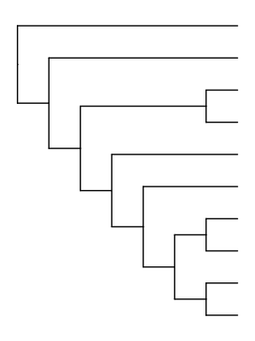<!-- -->

### Fig.2A bottom - enrichment

``` r
# load David result
path = 'data/Fig2A_KEGG_David_Pipridae.xlsx'
dv = read_excel(path) 

# plot heatmap
y = dv %>% 
  filter(PValue < 0.05) %>% 
  arrange(desc(Bonferroni)) %>% 
  mutate(sig = ifelse(Bonferroni < 0.05, '*', NA),
         Term2 = gsub("hsa\\d+:", "", Term))

pal <- brewer.pal(9, 'Reds')

pl = lapply(c("Pipridae"), function(s){
  # s = "Pipridae"
  z = y %>% filter(clade == s)
  y_lab = unique(z$Term2)
  z$Term2 = factor(z$Term2, y_lab)
  
  p <- z %>% 
    ggplot(aes(y = Term2, x = clade)) +
    geom_point(aes(fill = `Bonferroni`), shape = 22, size = 4, color = 'white') +
    geom_text(aes(label = sig), hjust = 0.5, vjust = 0.75) +
    scale_fill_gradient(high = pal[2], low = "#dc2943ff", n.breaks = 5, na.value = 'grey90') +
    ggtitle(s) +
    theme_classic() + 
    theme(axis.title.x = element_blank(), 
          axis.title.y = element_blank(), 
          axis.text.x = element_blank(),
          axis.text.y = element_blank(),
          axis.ticks = element_blank(),
          strip.text = element_blank(),
          plot.margin = unit(c(0.5,0,1,1), "cm"), # to increase, t,r,b,l
          legend.position = 'left',
          legend.direction = "horizontal",
          legend.key.size = unit(8, 'pt')); p
  
  size_max = 3
  size_data_min = min(z$Count)
  size_data_max = max(z$Count)
  p_term34 = z %>% 
    ggplot() +
    geom_point(aes(y = Term2,
                   x = clade, size = Count), color = 'grey50') +
    scale_size_binned(name = "Number of genes", range = c(0.2, size_max), 
                    limits = c(size_data_min, size_data_max), n.breaks = 3) +
    scale_y_discrete(position = "right") +
    ggtitle("") +
    theme_classic() +
    theme(axis.title.x = element_blank(), 
          axis.title.y = element_blank(), 
          axis.text.x = element_blank(),
          axis.ticks.x = element_blank(),
          strip.text = element_blank(),
          plot.margin = unit(c(0.5,1,1,0), "cm"), # to increase, t,r,b,l
          legend.position = 'right',
          legend.direction = "horizontal",
          legend.key.size = unit(8, 'pt')); p_term34
  p2 = cowplot::plot_grid(p, p_term34, nrow = 1, rel_widths = c(1,1.5)); p2
})

p = cowplot::plot_grid(plotlist = pl, ncol = 1); p
```

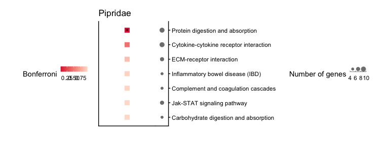<!-- -->

### Fig.2C tree

``` r

# for keeping the wanted tree tips
path = "data/Fig2C_TLE4_Arthur_aligned.fasta"
seqs = readDNAStringSet(path)
tokeep = names(seqs)
tokeep = sapply(tokeep, function(s){
  x = gsub("TLE4_Arthur_", "", s)
  stringr::str_to_title(x)}) # 21
tokeep = gsub("Budgie", "Budgerigar", tokeep) # for extract tips in tree

path = "data/Fig2C_EliotTreeMod_2020-11-16_modified.tre"
tree = read.tree(path)
setdiff(tree$tip.label, tokeep)
length(intersect(tree$tip.label, tokeep)) # 21 > good
setdiff(tokeep, tree$tip.label) # 0 > good

tree$tip.label[grep("Budg", tree$tip.label)]

tree_m = tree %>% ape::keep.tip(tokeep)
tree_m$tip.label = gsub("_", " ", tree_m$tip.label)


x_limit = max(tree_m$edge) * 0.8
tree_p = ggtree(tree_m, size = 0.375, branch.length = 'none' ) +
  geom_tiplab(offset = 0.25, size = FontSize) +  
  xlim_tree(x_limit) +
  theme_tree() ; # tree_p
tree_p2 = tree_p %>% rotate(22); tree_p2
```

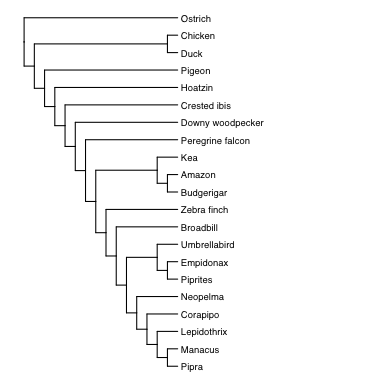<!-- -->

### Fig.2C color code

``` r
path = "data/Fig2C_TLE4_all_and_fancy_manakin_specific_variants_20230111.tsv"
trait = read_tsv(path) 

lowC = "#3737c8" # purple
highC = "#aa0088" # pink 

pb = ggplot(trait, aes(x = 1, y = UCNE_name, fill = Index)) +
  geom_point(color = "black", size = 5, shape = 22, stroke = 1) +
  scale_fill_gradient2(low = lowC, high = highC, mid = 'white', midpoint = 0, limits = c(-1, 1)) + 
  guides(fill = guide_colorbar(label.hjust = 1)) +
  theme_classic() + 
  theme(legend.position = 'right',
        axis.line = element_blank(),
        axis.title.x = element_blank(),
        axis.title.y = element_blank(),
        axis.text.x = element_blank(),
        axis.ticks = element_blank()); pb
```

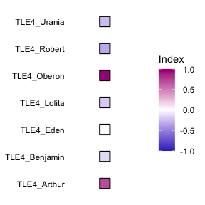<!-- -->

### Fig.2D 14 tips tree

``` r
path = "data/Fig2D_speciesNames_10_14.txt"
name_exchange = read_tsv(file = path, col_names = F)

# 14 sp tree
final14 = treeio::read.tree(text = "(AQCH,(MEUN,((FIAL,COCO),(SMCA,(RHHO,((CEOR,(PICH,EMTR)),((((MAVI,PIFI),LECO),COAL),NECH)))))));")
# plot(final14)

# change name
ind = sapply(final14$tip.label, function(s){grep(s, name_exchange$X1)})
final14$tip.label = name_exchange$X2[ind]

x_limit = max(final14$edge) * 0.8
tree_p = ggtree(final14, branch.length = 'none', ladderize = FALSE) +
  geom_tiplab(offset = 0.25, size = FontSize) +
  # geom_text(aes(label=node), hjust=-.3) +
  xlim_tree(x_limit) +
  theme_tree() ; 
```

    ## Warning in fortify(data, ...): Arguments in `...` must be used.
    ## ✖ Problematic arguments:
    ## • as.Date = as.Date
    ## • yscale_mapping = yscale_mapping
    ## • right = right
    ## • branch.length = branch.length
    ## • hang = hang
    ## ℹ Did you misspell an argument name?

``` r
tree_p = tree_p %>% rotate(15) %>% rotate(24) %>% rotate(27); tree_p
```

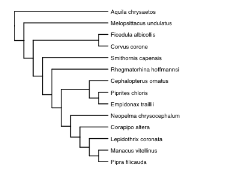<!-- -->

### Fig.2E absrel

``` r
path = "data/Fig2E_absrel_ordering.csv"
df_ordering = read_csv(path) 

path = "data/Fig2E_absrel_summary.csv"
df = read_csv(path)
df2 = df %>%
  mutate(unco = ifelse(`Uncorrected P-value` < 0.1, `Uncorrected P-value`, NA)) 

class_order = c("Diet_Carbohydrates", "Diet_Protein", "Diet_Fat", "Diet",
                "Vision", "Audition", "Telomere", "Muscle", "Sperm" )
df2$class = factor(df2$class, levels = class_order)
df2$gene = factor(df2$gene, levels = df_ordering$Gene)
df2$Name = factor(df2$Name, levels = c("Piprinae", "Pipridae", "Tyrannida")) 

color_low_tmp2 = 'red3'
color_highp_tmp2 = 'mistyrose'

p = ggplot(df2, aes(y = Name, x = gene, fill = unco)) +
  geom_tile(color = "grey90", size = 0.1) +
  geom_tile(aes(color = corrected5), size = 0.2, height = 0.9, width = 0.9) +
  scale_fill_gradient2(low = color_low_tmp2, mid = color_highp_tmp2, high = '#ccccccff',
                       midpoint = 0.05,
                       na.value = "transparent",
                       limits = c(0, 0.1), breaks = c(0, 0.05, 0.1)) +
  scale_color_manual(values = c("black"), na.value = "transparent") +
  scale_y_discrete(position = "right", expand = c(0,0)) +
  scale_x_discrete(expand = c(0,0)) +
  facet_grid(.~class, scales = 'free', space = 'free', switch = "x") +
  guides(colour = "none") +
  theme_classic() +
  theme(axis.text.x = element_text(size = AxisTxFontSizeSize_s,
                                   angle = 40, hjust = 1),
        legend.key.size = unit(5, 'pt'),
        strip.background.y = element_blank(),
        strip.text.y = element_blank(),
        axis.title = element_blank()
  ); p
```

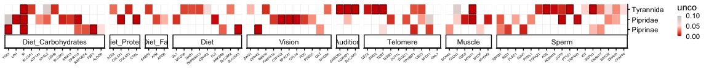<!-- -->

### Fig.S2D

## RNAseq

``` r
# tree for RNA muscle
path = "data/Fig2F_S2D-F_species_names_muscle_transcriptomes_tree_nobranchlen.nw"
manakin1b_tree_m = read.tree(file = path)

manakin1b_tree_m_d = manakin1b_tree_m %>% as_tibble() %>%
  mutate(label = gsub("Dixiphia_pipra", "Pseudopipra_pipra", label),
         label = gsub("_", " ", label)) %>%
  mutate(group = ifelse(grepl("Ceratopipra cornuta|Ceratopipra mentalis|Manacus vitellinus", label), 
                        "target1", NA),
         group = ifelse(grepl("Manacus vitellinus", label), 
                        "target2", group),
         wingsnap = ifelse(grepl("target", group), 'yes', NA)) 
manakin1b_tree_m2 = manakin1b_tree_m_d %>% as.treedata()

x_limit = max(manakin1b_tree_m2@phylo$edge) * 1.5
rootedge = min(manakin1b_tree_m2@phylo$edge, na.rm = TRUE) * 1
tree_p = ggtree(manakin1b_tree_m2, size = 0.25, aes(color = group)) + 
  geom_tiplab(offset = 0.2, size = FontSize) + 
  scale_color_manual(values=c("#9c2c29ff", "#9c2c29ff"), na.value = "black") +
  xlim_tree(x_limit) +
  theme_tree() + theme(legend.position = 'none'); # tree_p
tree_p = tree_p %>% rotate(8) %>% rotate(13) ; tree_p 
```

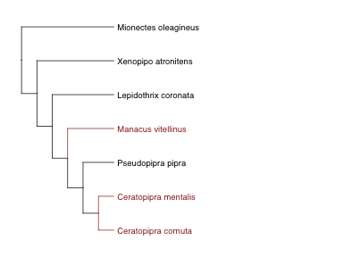<!-- -->

``` r
wingsnap = manakin1b_tree_m_d %>% select(label, wingsnap) %>%
  filter(!is.na(label))


# RNAseq data
path = "data/Fig2F_S2D-F_2025-12-02-cpmdata.xlsx"
data2 = read_excel(path = path)

datal2_SH = data2 %>% 
  dplyr::select(Gene, matches("SH")) %>% 
  pivot_longer(cols = matches("SH"), names_to = "sample", values_to = "cpm") %>% 
  dplyr::rename(gene = Gene) %>% 
  mutate(tissue = "SH",
         ind =  gsub("(\\w+).(\\d+).\\w+", "\\2", sample)) %>% 
  mutate(species = case_when(grepl("Mo", sample) ~ "MIOL",
                              grepl("Xa", sample) ~ "XEAT",
                              grepl("Lc", sample) ~ "LECO",
                              grepl("Mv", sample) ~ "MAVI",
                              grepl("Pp", sample) ~ "PSPI",
                              grepl("Cm", sample) ~ "CEME",
                              grepl("Cc", sample) ~ "CECO"
                              ),
         species2 = case_when(grepl("Mo", sample) ~ "Mionectes oleagineus",
                              grepl("Xa", sample) ~ "Xenopipo atronitens",
                              grepl("Lc", sample) ~ "Lepidothrix coronata",
                              grepl("Mv", sample) ~ "Manacus vitellinus",
                              grepl("Pp", sample) ~ "Pseudopipra pipra",
                              grepl("Cm", sample) ~ "Ceratopipra mentalis",
                              grepl("Cc", sample) ~ "Ceratopipra cornuta"
         )) %>%
  group_by(gene, tissue, species) %>%
  mutate(mean = mean(cpm, na.rm = TRUE),
         n = n(),
         sd = sd(cpm, na.rm = TRUE)) %>% 
  mutate(sem = sd/sqrt(n)) 

datal2_PEC = data2 %>% 
  dplyr::select(Gene, matches("PEC")) %>% 
  pivot_longer(cols = matches("PEC"), names_to = "sample", values_to = "cpm") %>% 
  dplyr::rename(gene = Gene) %>% 
  mutate(tissue = "PEC",
         ind =  gsub("(\\w+).(\\d+).\\w+", "\\2", sample)) %>% 
  mutate(species = case_when(grepl("Mo", sample) ~ "MIOL",
                             grepl("Xa", sample) ~ "XEAT",
                             grepl("Lc", sample) ~ "LECO",
                             grepl("Mv", sample) ~ "MAVI",
                             grepl("Pp", sample) ~ "PSPI",
                             grepl("Cm", sample) ~ "CEME",
                             grepl("Cc", sample) ~ "CECO"
  ),
  species2 = case_when(grepl("Mo", sample) ~ "Mionectes oleagineus",
                       grepl("Xa", sample) ~ "Xenopipo atronitens",
                       grepl("Lc", sample) ~ "Lepidothrix coronata",
                       grepl("Mv", sample) ~ "Manacus vitellinus",
                       grepl("Pp", sample) ~ "Pseudopipra pipra",
                       grepl("Cm", sample) ~ "Ceratopipra mentalis",
                       grepl("Cc", sample) ~ "Ceratopipra cornuta"
  )) %>%
  group_by(gene, tissue, species) %>%
  mutate(mean = mean(cpm, na.rm = TRUE),
         n = n(),
         sd = sd(cpm, na.rm = TRUE)) %>% 
  mutate(sem = sd/sqrt(n)) 

datal25 = datal2_PEC %>% bind_rows(datal2_SH) %>%
  mutate(ymin = mean-sem, ymax = mean+sem)


# subset
PEC_UTP20 =  datal25 %>% filter(tissue == "PEC", gene == "UTP20") 
PEC_UTP20d =  PEC_UTP20 %>% select(species2, gene, mean, sem, ymin, ymax, tissue, species) %>% 
  distinct() 
SH_UTP20 =  datal25 %>% filter(tissue == "SH", gene == "UTP20") 
SH_UTP20d =  SH_UTP20 %>% select(species2, gene, mean, sem, ymin, ymax, tissue, species) %>% 
  distinct() 

PEC_ADPRH =  datal25 %>% filter(tissue == "PEC", gene == "ADPRH") 
PEC_ADPRHd =  PEC_ADPRH %>% select(species2, gene, mean, sem, ymin, ymax, tissue, species) %>% 
  distinct() 
SH_ADPRH =  datal25 %>% filter(tissue == "SH", gene == "ADPRH") 
SH_ADPRHd =  SH_ADPRH %>% select(species2, gene, mean, sem, ymin, ymax, tissue, species) %>% 
  distinct() 

PEC_SCN4A =  datal25 %>% filter(tissue == "PEC", gene == "SCN4A") 
PEC_SCN4Ad =  PEC_SCN4A %>% select(species2, gene, mean, sem, ymin, ymax, tissue, species) %>% 
  distinct() 
SH_SCN4A =  datal25 %>% filter(tissue == "SH", gene == "SCN4A") 
SH_SCN4Ad =  SH_SCN4A %>% select(species2, gene, mean, sem, ymin, ymax, tissue, species) %>% 
  distinct() 

PEC_JPH2 =  datal25 %>% filter(tissue == "PEC", gene == "JPH2") 
PEC_JPH2d =  PEC_JPH2 %>% select(species2, gene, mean, sem, ymin, ymax, tissue, species) %>% 
  distinct() 
SH_JPH2 =  datal25 %>% filter(tissue == "SH", gene == "JPH2") 
SH_JPH2d =  SH_JPH2 %>% select(species2, gene, mean, sem, ymin, ymax, tissue, species) %>% 
  distinct() 
```

### Fig.2F

``` r
tree_p2 = tree_p +
  
  ### SH_SCN4A
  geom_facet(aes(x = mean, xmin = ymin, xmax = ymax), data = SH_SCN4Ad, panel = 'SCN4A', 
             geom = geom_linerange, size = 0.5, alpha = 0.5) + 
  geom_facet(aes(x = mean), data = SH_SCN4Ad, panel = 'SCN4A',
             geom = geom_point, size = 1, alpha = 1, shape = 21, fill = 'white') + 
  geom_facet(aes(x = mean), data = SH_SCN4Ad, panel = 'SCN4A',
             geom = geom_point, size = 1, alpha = 0.5) + 
  
  ### SH_JPH2
  geom_facet(aes(x = mean, xmin = ymin, xmax = ymax), data = SH_JPH2d, panel = 'JPH2', 
             geom = geom_linerange, size = 0.5, alpha = 0.5) + 
  geom_facet(aes(x = mean), data = SH_JPH2d, panel = 'JPH2',
             geom = geom_point, size = 1, alpha = 1, shape = 21, fill = 'white') + 
  geom_facet(aes(x = mean), data = SH_JPH2d, panel = 'JPH2',
             geom = geom_point, size = 1, alpha = 0.5) + 
  
  scale_x_continuous(name = "cpm") +
  theme_classic() +
  theme(axis.text.y = element_blank(),
        axis.title.x = element_text(size = AxisTxFontSizeSize),
        panel.border = element_rect(color = "black", size = 0.1, fill = NA),
        strip.background = element_rect(fill = NA, color = NA),
        axis.ticks.x = element_line(colour = "black", size = 0.1)
        # axis.title.x = element_blank()
        # axis.text.x = element_blank()
  ); # tree_p2

tree_p3 <- facet_widths(tree_p2, widths = c(Tree = 3, wingsnap = 0.5, SCN4A = 1, JPH2 = 1)); tree_p3
```

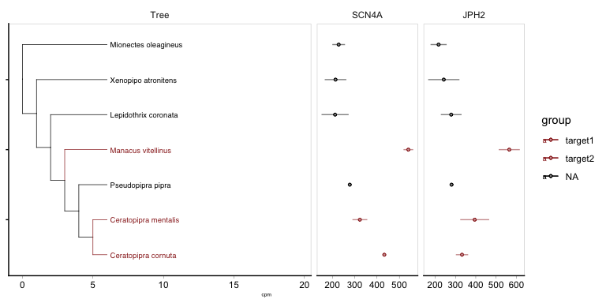<!-- -->

### Fig.S2E

``` r
tree_p2 = tree_p +
  
  ### SH_SCN4A
  geom_facet(aes(x = mean, xmin = ymin, xmax = ymax), data = SH_SCN4Ad, panel = 'SCN4A', 
             geom = geom_linerange, size = 0.5, alpha = 0.5) + 
  geom_facet(aes(x = mean), data = SH_SCN4Ad, panel = 'SCN4A',
             geom = geom_point, size = 1, alpha = 1, shape = 21, fill = 'white') + 
  geom_facet(aes(x = mean), data = SH_SCN4Ad, panel = 'SCN4A',
             geom = geom_point, size = 1, alpha = 0.5) + 
  
  ### SH_JPH2d
  geom_facet(aes(x = mean, xmin = ymin, xmax = ymax), data = SH_JPH2d, panel = 'JPH2', 
             geom = geom_linerange, size = 0.5, alpha = 0.5) + 
  geom_facet(aes(x = mean), data = SH_JPH2d, panel = 'JPH2',
             geom = geom_point, size = 1, alpha = 1, shape = 21, fill = 'white') + 
  geom_facet(aes(x = mean), data = SH_JPH2d, panel = 'JPH2',
             geom = geom_point, size = 1, alpha = 0.5) + 
  
  ### SH_UTP20
  geom_facet(aes(x = mean, xmin = ymin, xmax = ymax), data = SH_UTP20d, panel = 'UTP20', 
             geom = geom_linerange, size = 0.5, alpha = 0.5) + 
  geom_facet(aes(x = mean), data = SH_UTP20d, panel = 'UTP20',
             geom = geom_point, size = 1, alpha = 1, shape = 21, fill = 'white') + 
  geom_facet(aes(x = mean), data = SH_UTP20d, panel = 'UTP20',
             geom = geom_point, size = 1, alpha = 0.5) + 
  
  ### SH_ADPRH
  geom_facet(aes(x = mean, xmin = ymin, xmax = ymax), data = SH_ADPRHd, panel = 'ADPRH', 
             geom = geom_linerange, size = 0.5, alpha = 0.5) + 
  geom_facet(aes(x = mean), data = SH_ADPRHd, panel = 'ADPRH',
             geom = geom_point, size = 1, alpha = 1, shape = 21, fill = 'white') + 
  geom_facet(aes(x = mean), data = SH_ADPRHd, panel = 'ADPRH',
             geom = geom_point, size = 1, alpha = 0.5) + 
  
  scale_x_continuous(name = "cpm") +
  theme_classic() +
  theme(axis.text.y = element_blank(),
        axis.title.x = element_text(size = AxisTxFontSizeSize),
        panel.border = element_rect(color = "black", size = 0.1, fill = NA),
        strip.background = element_rect(fill = NA, color = NA),
        axis.ticks.x = element_line(colour = "black", size = 0.1)
  ); # tree_p2

tree_p3 <- facet_widths(tree_p2, widths = c(Tree = 2, wingsnap = 0.5, SCN4A = 1, JPH2 = 1, UTP20 = 1, ADPRH = 1)); tree_p3
```

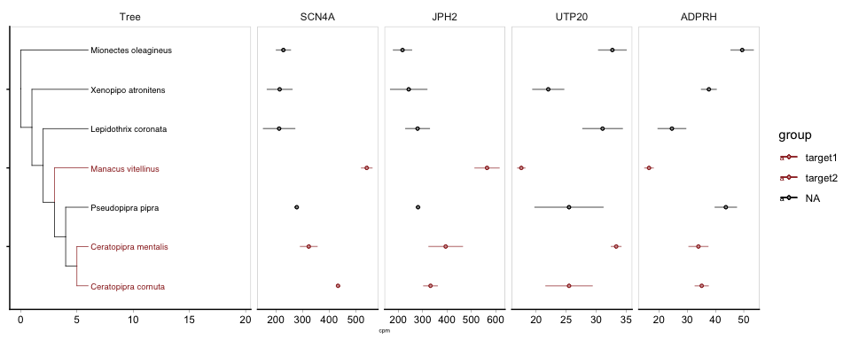<!-- -->

### Fig.S2F

``` r
tree_p3 = tree_p +
  
  ### PEC_SCN4A
  geom_facet(aes(x = mean, xmin = ymin, xmax = ymax), data = PEC_SCN4Ad, panel = 'SCN4A', 
             geom = geom_linerange, size = 0.5, alpha = 0.5) + 
  geom_facet(aes(x = mean), data = PEC_SCN4Ad, panel = 'SCN4A',
             geom = geom_point, size = 1, alpha = 1, shape = 21, fill = 'white') + 
  geom_facet(aes(x = mean), data = PEC_SCN4Ad, panel = 'SCN4A',
             geom = geom_point, size = 1, alpha = 0.5) + 
  
  ### PEC_JPH2d
  geom_facet(aes(x = mean, xmin = ymin, xmax = ymax), data = PEC_JPH2d, panel = 'JPH2', 
             geom = geom_linerange, size = 0.5, alpha = 0.5) + 
  geom_facet(aes(x = mean), data = PEC_JPH2d, panel = 'JPH2',
             geom = geom_point, size = 1, alpha = 1, shape = 21, fill = 'white') + 
  geom_facet(aes(x = mean), data = PEC_JPH2d, panel = 'JPH2',
             geom = geom_point, size = 1, alpha = 0.5) + 
  
  ### PEC_UTP20
  geom_facet(aes(x = mean, xmin = ymin, xmax = ymax), data = PEC_UTP20d, panel = 'UTP20', 
             geom = geom_linerange, size = 0.5, alpha = 0.5) + 
  geom_facet(aes(x = mean), data = PEC_UTP20d, panel = 'UTP20',
             geom = geom_point, size = 1, alpha = 1, shape = 21, fill = 'white') + 
  geom_facet(aes(x = mean), data = PEC_UTP20d, panel = 'UTP20',
             geom = geom_point, size = 1, alpha = 0.5) + 
  
  ### PEC_ADPRH
  geom_facet(aes(x = mean, xmin = ymin, xmax = ymax), data = PEC_ADPRHd, panel = 'ADPRH', 
             geom = geom_linerange, size = 0.5, alpha = 0.5) + 
  geom_facet(aes(x = mean), data = PEC_ADPRHd, panel = 'ADPRH',
             geom = geom_point, size = 1, alpha = 1, shape = 21, fill = 'white') + 
  geom_facet(aes(x = mean), data = PEC_ADPRHd, panel = 'ADPRH',
             geom = geom_point, size = 1, alpha = 0.5) + 
  
  scale_x_continuous(name = "cpm") +
  theme_classic() +
  theme(axis.text.y = element_blank(),
        axis.title.x = element_text(size = AxisTxFontSizeSize),
        panel.border = element_rect(color = "black", size = 0.1, fill = NA),
        strip.background = element_rect(fill = NA, color = NA),
        axis.ticks.x = element_line(colour = "black", size = 0.1)
  ); # tree_p3

tree_p4 <- facet_widths(tree_p3, widths = c(Tree = 2, wingsnap = 0.5, SCN4A = 1, JPH2 = 1, UTP20 = 1, ADPRH = 1)); tree_p4
```

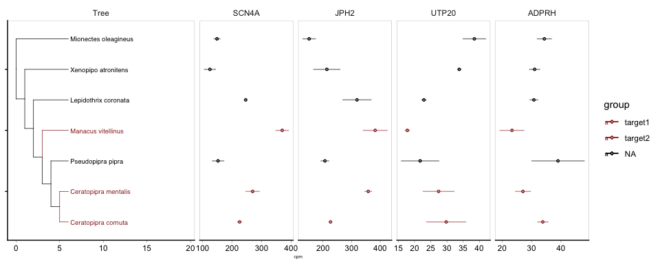<!-- -->

### Fig.2G absrel

``` r
library(jsonlite)
library(tidyverse)
library(ggtree)
library(treeio)
library(gridExtra)
library(grid)

linewidth  <- 0.5
x_limit    <- 15
tip_size   <- 2
rootedge   <- 2

# Species abbreviation to full name
rename_tips <- function(tips) {
  tips <- gsub("AQCH", "Aquila",        tips, ignore.case = TRUE)
  tips <- gsub("CEOR", "Cephalopterus", tips, ignore.case = TRUE)
  tips <- gsub("COAL", "Corapipo",      tips, ignore.case = TRUE)
  tips <- gsub("COCO", "Corvus",        tips, ignore.case = TRUE)
  tips <- gsub("EMTR", "Empidonax",     tips, ignore.case = TRUE)
  tips <- gsub("FIAL", "Ficedula",      tips, ignore.case = TRUE)
  tips <- gsub("LECO", "Lepidothrix",   tips, ignore.case = TRUE)
  tips <- gsub("MAVI", "Manacus",       tips, ignore.case = TRUE)
  tips <- gsub("MEUN", "Melopsittacus", tips, ignore.case = TRUE)
  tips <- gsub("NECH", "Neopelma",      tips, ignore.case = TRUE)
  tips <- gsub("PIFI", "Pipra",         tips, ignore.case = TRUE)
  tips <- gsub("PICH", "Piprites",      tips, ignore.case = TRUE)
  tips <- gsub("RHHO", "Rhegmatorhina", tips, ignore.case = TRUE)
  tips <- gsub("SMCA", "Smithornis",    tips, ignore.case = TRUE)
  tips
}

# 1. LPH
tmp_LPH  <- fromJSON(txt = "data/Fig2G_LPH.json")
gene_LPH  <- "LPH"

tree_LPH <- read.tree(text = paste0(tmp_LPH$input$trees$`0`, ";"))
tree_LPH$tip.label <- rename_tips(tree_LPH$tip.label)

tmp_b_LPH <- tmp_LPH$`branch attributes`$`0`
df_LPH <- lapply(seq_along(tmp_b_LPH), function(i) {
  tmp_b_LPH[[i]] %>%
    map_if(is.matrix, function(s) data.frame(matrix(s, nrow = 1))) %>%
    map_if(is.data.frame, list) %>%
    as_tibble() %>% unnest(cols = c(`Rate Distributions`))
}) %>% bind_rows() %>%
  add_column("Name" = names(tmp_b_LPH)) %>%
  select(-`original name`)

ind_LPH <- grep("X\\d+", names(df_LPH))
omega_LPH <- df_LPH[, ind_LPH] %>% as.matrix()
omega_sorted_LPH <- lapply(seq_len(nrow(omega_LPH)), function(i) {
  x <- na.omit(omega_LPH[i, ]); n <- length(x); half <- n / 2
  cbind("Name" = df_LPH$Name[i],
        setNames(as.data.frame(matrix(x[1:half],       nrow = 1)), paste0("Omega",      1:half)),
        setNames(as.data.frame(matrix(x[(half+1):n],   nrow = 1)), paste0("Proportion", 1:half)),
        HighestOmega = x[half], HighestProportion = x[n]) %>% as_tibble()
}) %>% bind_rows()

df3_LPH <- df_LPH %>%
  select(-all_of(ind_LPH)) %>%
  left_join(omega_sorted_LPH) %>%
  mutate(`Uncorrected_P<0.05` = ifelse(`Uncorrected P-value` < 0.05, `Uncorrected P-value`, NA),
         `Corrected_P<0.05`   = ifelse(`Corrected P-value`   < 0.05, `Corrected P-value`,   NA))

tree_phy_LPH <- tree_LPH %>% as_tibble() %>%
  left_join(df3_LPH, by = c("label" = "Name")) %>%
  as.treedata()

# LPH - uncorrected p-value
p_LPH_uncorr <- ggtree(tree_phy_LPH, size = linewidth, aes(col = `Uncorrected_P<0.05`)) +
  geom_tiplab(offset = x_limit / 50, size = tip_size, color = "grey10", fontface = 3) +
  xlim_tree(x_limit) +
  scale_color_continuous(low = "red", high = "rosybrown1", na.value = "grey50",
                         n.breaks = 3, limits = c(0, 0.05)) +
  guides(color = guide_colorbar(title = "p value", reverse = TRUE)) +
  ggtitle(paste0(gene_LPH, "\nUncorrected P < 0.05")) 
p_LPH_uncorr <- p_LPH_uncorr %>% rotate(15)

# 2. T1R3
tmp_T1R3 <- fromJSON(txt = "data/Fig2G_T1R3.json")
gene_T1R3 <- "T1R3"

tree_T1R3 <- read.tree(text = paste0(tmp_T1R3$input$trees$`0`, ";"))
tree_T1R3$tip.label <- rename_tips(tree_T1R3$tip.label)

tmp_b_T1R3 <- tmp_T1R3$`branch attributes`$`0`
df_T1R3 <- lapply(seq_along(tmp_b_T1R3), function(i) {
  tmp_b_T1R3[[i]] %>%
    map_if(is.matrix, function(s) data.frame(matrix(s, nrow = 1))) %>%
    map_if(is.data.frame, list) %>%
    as_tibble() %>% unnest(cols = c(`Rate Distributions`))
}) %>% bind_rows() %>%
  add_column("Name" = names(tmp_b_T1R3)) %>%
  select(-`original name`)

ind_T1R3 <- grep("X\\d+", names(df_T1R3))
omega_T1R3 <- df_T1R3[, ind_T1R3] %>% as.matrix()
omega_sorted_T1R3 <- lapply(seq_len(nrow(omega_T1R3)), function(i) {
  x <- na.omit(omega_T1R3[i, ]); n <- length(x); half <- n / 2
  cbind("Name" = df_T1R3$Name[i],
        setNames(as.data.frame(matrix(x[1:half],       nrow = 1)), paste0("Omega",      1:half)),
        setNames(as.data.frame(matrix(x[(half+1):n],   nrow = 1)), paste0("Proportion", 1:half)),
        HighestOmega = x[half], HighestProportion = x[n]) %>% as_tibble()
}) %>% bind_rows()

df3_T1R3 <- df_T1R3 %>%
  select(-all_of(ind_T1R3)) %>%
  left_join(omega_sorted_T1R3) %>%
  mutate(`Uncorrected_P<0.05` = ifelse(`Uncorrected P-value` < 0.05, `Uncorrected P-value`, NA),
         `Corrected_P<0.05`   = ifelse(`Corrected P-value`   < 0.05, `Corrected P-value`,   NA))

tree_phy_T1R3 <- tree_T1R3 %>% as_tibble() %>%
  left_join(df3_T1R3, by = c("label" = "Name")) %>%
  as.treedata()

# T1R3 - uncorrected p-value
p_T1R3_uncorr <- ggtree(tree_phy_T1R3, size = linewidth, aes(col = `Uncorrected_P<0.05`)) +
  geom_tiplab(offset = x_limit / 50, size = tip_size, color = "grey10", fontface = 3) +
  xlim_tree(x_limit) +
  scale_color_continuous(low = "red", high = "rosybrown1", na.value = "grey50",
                         n.breaks = 3, limits = c(0, 0.05)) +
  guides(color = guide_colorbar(title = "p value", reverse = TRUE)) +
  ggtitle(paste0(gene_T1R3, "\nUncorrected P < 0.05")) 
p_T1R3_uncorr <- p_T1R3_uncorr %>% rotate(15)

# 3. Arrange and display
p_out <- cowplot::plot_grid(p_T1R3_uncorr, p_LPH_uncorr,
                     nrow = 1, ncol = 2)
p_out
```

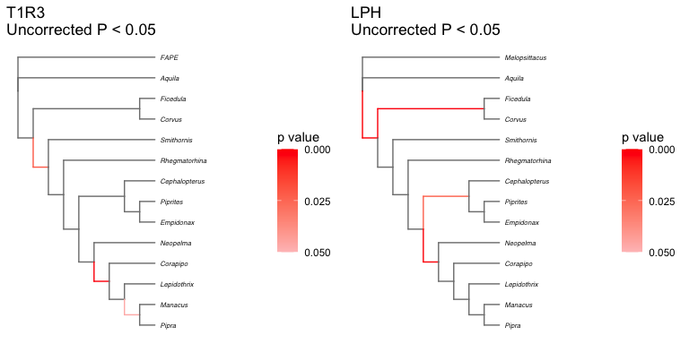<!-- -->
