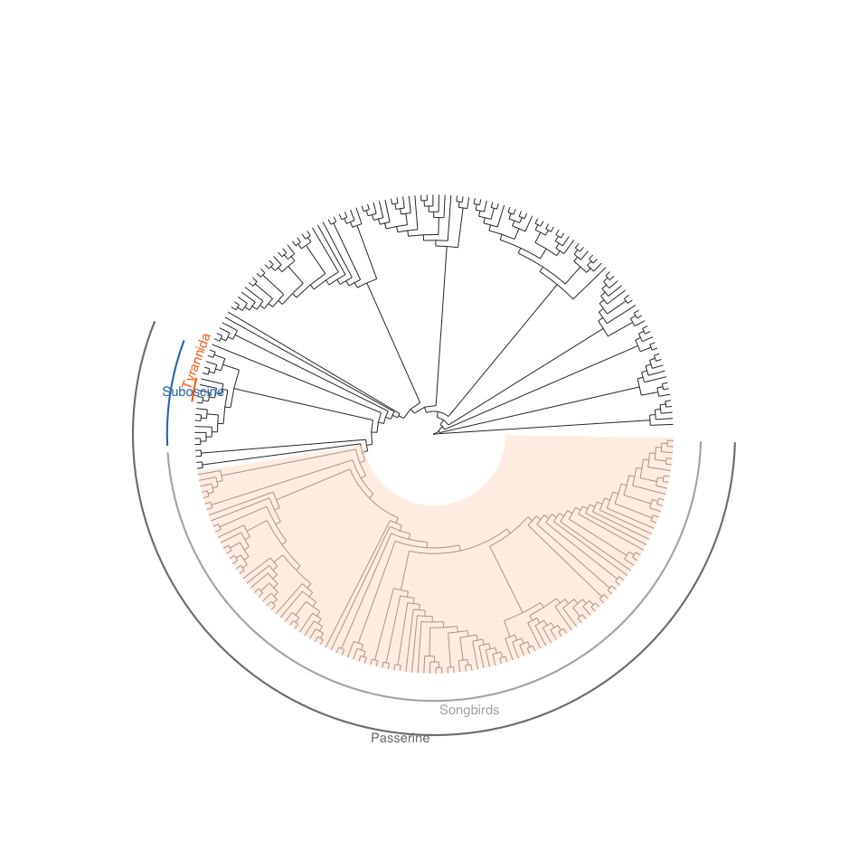
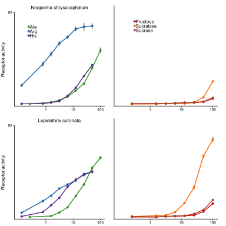
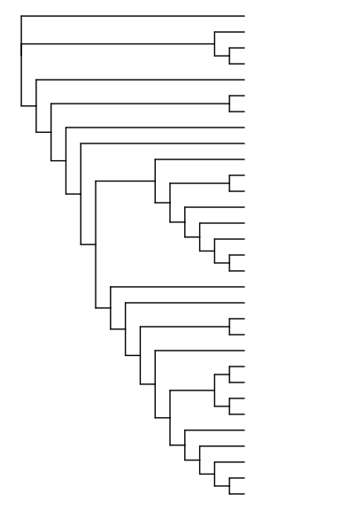
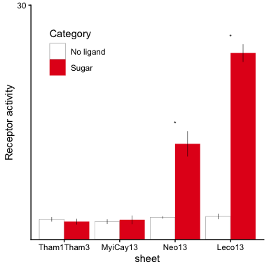
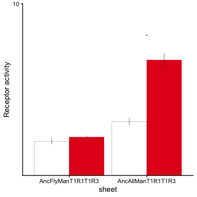
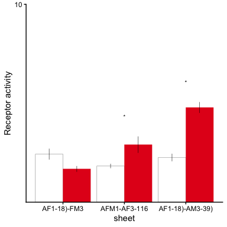
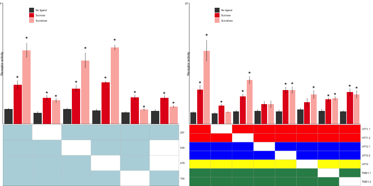
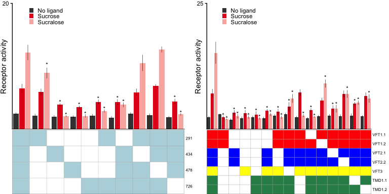
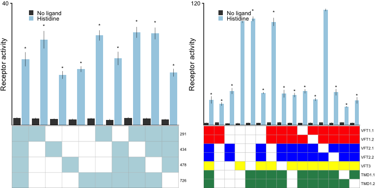

Manakin figure 3 related
================
Maggie
2026-02-28

- [Fig.3A](#fig3a)
- [Fig.3B](#fig3b)
- [Fig.3C tree](#fig3c-tree)
- [Load file for 3C to 3E](#load-file-for-3c-to-3e)
  - [Fig.3C](#fig3c)
  - [Fig.3D](#fig3d)
  - [Fig.3E](#fig3e)
  - [Fig.3F](#fig3f)
  - [Fig.S3D](#figs3d)
  - [Fig.S3E](#figs3e)

This [R Markdown](http://rmarkdown.rstudio.com) Notebook contains codes
for reproducing Fig.3A-F and Fig.S3D, S3E of Balakrishnan et
al. ‘Genomic and physiological changes in a sexually selected and
frugivorous bird radiation’.

### Fig.3A

``` r
path = "data/Fig3A_EliotTreeMod_2020-11-16.nw"
tree = read.tree(path)
# plot(tree)

barsize = 0.75
tree_p = ggtree(tree, branch.length = 'none', layout = 'circular', size = 0.3) + 
  # geom_text(aes(label=node), hjust=-.3, size = 2) +
  geom_hilight(node=263, fill="#FFE6D5", alpha=.6) + 
  geom_cladelab(node=259, label="Passerine", align=TRUE, 
                offset.text = 1, offset = 10, angle = 0, barsize = barsize,
                textcolor='#7f7f7fff', barcolor='#7f7f7fff') +
  geom_cladelab(node=261, label="Songbirds", align=TRUE,
                offset.text = 1, offset = 4, angle = 0, barsize = barsize,
                textcolor='#b3b3b3ff', barcolor='#b3b3b3ff') +
  geom_cladelab(node=382, label="Suboscine", align=TRUE,
                offset.text = 1, offset = 4, angle = 0, barsize = barsize,
                textcolor='#377eb8ff', barcolor='#377eb8ff') +
  geom_cladelab(node=384, label="Tyrannida", align=TRUE,
                offset.text = 1, offset = 0, angle = 70, barsize = barsize,
                textcolor='#ff7214ff', barcolor='#ff7214ff') +
  xlim(0, 60) +
  theme_tree() ; tree_p 
```

<!-- -->

### Fig.3B

``` r
path = "data/Fig3B.csv"
df = read_csv(path)

errorbar_size = 0.5
point_size = 1
line_size = 0.5
x_labels = c(1.0, 10, 100)
xMin = 0.1
xMax = x_labels[length(x_labels)]
y_max = 85

col_pal = brewer.pal(12, "Paired")
col_pal_sugar = col_pal[c(6, 8, 12)]
col_pal_aa = col_pal[c(4, 2, 10)]

species_labels = c("Neo" = "Neopelma chrysocephalum", "Leco" = "Lepidothrix coronata")

make_plot = function(s, category) {
  is_sugar = category == "Sugar"
  is_first = s == "Neo"
  col_pal_use = if (is_sugar) col_pal_sugar else col_pal_aa
  legend_x = if (is_sugar) 0.3 else 0.2
  
  df_subset = df %>% filter(Chimera == s, if (is_sugar) Category == "Sugar" else Category != "Sugar")
  
  ggplot(data = df_subset, aes(color = Ligand)) +
    geom_errorbar(aes(x = `Concentraction (mM)`, ymin = mean - sem, ymax = mean + sem),
                  width = 0, size = errorbar_size, color = "grey50") +
    geom_line(aes(x = `Concentraction (mM)`, y = mean), size = line_size, show.legend = FALSE) +
    geom_point(aes(x = `Concentraction (mM)`, y = mean), size = point_size) +
    scale_x_log10(labels = x_labels, breaks = x_labels, limits = c(xMin, xMax)) +
    scale_y_continuous(name = "Receptor activity", expand = c(0, 0), limits = c(0, y_max), breaks = y_max) +
    scale_color_manual(values = col_pal_use) +
    ggtitle(if (!is_sugar) species_labels[s] else NULL) +
    theme_classic(base_size = 6) +
    theme(
      plot.title   = element_text(hjust = 0.5, size = 6),
      plot.margin  = unit(c(0.5, 0.75, 0.1, 0.1), "lines"),
      axis.title.x = element_blank(),
      axis.title.y = if (!is_sugar) element_text(size = 6, angle = 90, margin = margin(r = 3)) else element_blank(),
      axis.text.y  = if (!is_sugar) element_text() else element_blank(),
      axis.ticks.y = if (!is_sugar) element_line() else element_blank(),
      legend.position = if (is_first) c(legend_x, 0.8) else "none",
      legend.key.size = unit(1, "pt"),
      legend.margin   = margin(0, 0, 0, 0),
      legend.text     = element_text(size = 6, margin = margin(0, 0, 0, 0, "pt")),
      legend.title    = element_blank())
}

p_out = cowplot::plot_grid(
  make_plot("Neo", "AA"),    make_plot("Neo", "Sugar"),
  make_plot("Leco", "AA"),   make_plot("Leco", "Sugar"),
  nrow = 2
); p_out
```

<!-- -->

## Fig.3C tree

``` r
tree = "data/Fig3C_treeDec15_T1R1.txt.newick" 
tree_m = read.tree(file = tree)

tree_p = ggtree(tree_m, branch.length = 'none', ladderize = T) +
  # geom_tiplab(offset = 0, size = FontSize*1) +
  xlim(0, 20) +
  theme_tree() ; # tree_p 
tree_p = tree_p %>% rotate(32); tree_p
```

<!-- -->

## Load file for 3C to 3E

``` r
path = "data/Fig3C-E.csv"
df = read_csv(path)

path = "data/Fig3C-E_stats.csv"
stats = read_csv(path)
```

### Fig.3C

``` r
df_subset = df %>% filter(type == "WT")

which_stat = "sig (pval_onesided<0.05)"
tmp_stat_df = stats %>%
  filter(chimera %in% df_subset$sheet) %>%
  dplyr::rename("sheet" = "chimera", "Ligand" = "ligand_2") %>%
  dplyr::select(sheet, Ligand, matches('sig')) %>%
  mutate(lab = ifelse(!! rlang::sym(which_stat) == 'yes', '*', NA)) %>%
  left_join(df_subset)
tmp_stat_df$sheet = factor(tmp_stat_df$sheet, levels = c("Tham1Tham3", "MyiCay13", "Neo13", "Leco13"))

y_limit_sugar = 30
pal = brewer.pal(9, "Set1")
col_palette_sugar = c("white", pal[1])
col_palette_sugar_stroke = c("black", pal[1])
  
p_sugar1 = ggplot(data = df_subset, aes(x = sheet, group = Ligand)) +
  geom_col(aes(y = mean, fill = Category, color = Category), 
           position = position_dodge(),
           linewidth = 0.1) +
  geom_errorbar(aes(ymin = mean-sem, ymax = mean+sem), 
                position = position_dodge(width = 0.9),
                width = 0, linewidth = 0.2) + 
  geom_text(data = tmp_stat_df, aes(y = (mean+sem) + 1, label = lab), 
            position = position_dodge(width = 0.9),
            size = FontSize) +
  scale_y_continuous(name = 'Receptor activity', limits = c(NA, y_limit_sugar), 
                     breaks = y_limit_sugar,
                     expand = c(0, 0)) + 
  scale_fill_manual(values = alpha(col_palette_sugar, 1)) +
  scale_color_manual(values = col_palette_sugar_stroke) +
  theme_classic() + 
  theme(strip.text = element_blank(),
        legend.position = c(0.2, 0.8)); p_sugar1 # t,r,b,l 
```

<!-- -->

### Fig.3D

``` r
df_subset = df %>% filter(type == "anc")

which_stat = "sig (pval_onesided<0.05)"
tmp_stat_df = stats %>% 
  filter(chimera %in% df_subset$sheet, ligand_2 %in% df_subset$Ligand) %>%
  dplyr::rename("sheet" = "chimera", "Ligand" = "ligand_2") %>%
  dplyr::select(sheet, Ligand, matches('sig')) %>%
  mutate(lab = ifelse(!! rlang::sym(which_stat) == 'yes', '*', NA)) %>%
  left_join(df_subset)
tmp_stat_df$sheet = factor(tmp_stat_df$sheet, levels = c("AncFlyManT1R1T1R3", "AncAllManT1R1T1R3"))

y_limit_sugar = 10
pal = brewer.pal(9, "Set1")
col_palette_sugar = c("white", pal[1])
col_palette_sugar_stroke = c("black", pal[1])

p_sugar2 = ggplot(data = df_subset, aes(x = sheet, group = Ligand)) +
  geom_col(aes(y = mean, fill = Category, color = Category), 
           position = position_dodge(),
           linewidth = 0.1) +
  geom_errorbar(aes(ymin = mean-sem, ymax = mean+sem), 
                position = position_dodge(width = 0.9),
                width = 0, linewidth = 0.2) + 
  geom_text(data = tmp_stat_df, aes(y = (mean+sem) + 1, label = lab), 
            position = position_dodge(width = 0.9),
            size = FontSize) +
  scale_y_continuous(name = 'Receptor activity', limits = c(NA, y_limit_sugar), 
                     breaks = y_limit_sugar,
                     expand = c(0, 0)) + 
  scale_fill_manual(values = alpha(col_palette_sugar, 1)) +
  scale_color_manual(values = col_palette_sugar_stroke) +
  theme_classic() + 
  theme(strip.text = element_blank(),
        legend.position = "none"); p_sugar2 # t,r,b,l 
```

<!-- -->

### Fig.3E

``` r
df_subset = df %>% filter(type == "chimera")

which_stat = "sig (pval_onesided<0.05)"
tmp_stat_df = stats %>% 
  filter(chimera %in% df_subset$sheet, ligand_2 %in% df_subset$Ligand) %>%
  dplyr::rename("sheet" = "chimera", "Ligand" = "ligand_2") %>%
  dplyr::select(sheet, Ligand, matches('sig')) %>%
  mutate(lab = ifelse(!! rlang::sym(which_stat) == 'yes', '*', NA)) %>%
  left_join(df_subset)
tmp_stat_df$sheet = factor(tmp_stat_df$sheet, levels = c("AF1-18)-FM3", "AFM1-AF3-116", "AF1-18)-AM3-39)"))

y_limit_sugar = 10
pal = brewer.pal(9, "Set1")
col_palette_sugar = c("white", pal[1])
col_palette_sugar_stroke = c("black", pal[1])

p_sugar2 = ggplot(data = df_subset, aes(x = sheet, group = Ligand)) +
  geom_col(aes(y = mean, fill = Category, color = Category), 
           position = position_dodge(),
           linewidth = 0.1) +
  geom_errorbar(aes(ymin = mean-sem, ymax = mean+sem), 
                position = position_dodge(width = 0.9),
                width = 0, linewidth = 0.2) + 
  geom_text(data = tmp_stat_df, aes(y = (mean+sem) + 1, label = lab), 
            position = position_dodge(width = 0.9),
            size = FontSize) +
  scale_y_continuous(name = 'Receptor activity', limits = c(NA, y_limit_sugar), 
                     breaks = y_limit_sugar,
                     expand = c(0, 0)) + 
  scale_fill_manual(values = alpha(col_palette_sugar, 1)) +
  scale_color_manual(values = col_palette_sugar_stroke) +
  theme_classic() + 
  theme(strip.text = element_blank(),
        legend.position = "none"); p_sugar2 # t,r,b,l 
```

<!-- -->

### Fig.3F

``` r
path = "data/Fig3F.csv"
df = read_csv(path)

path = "data/Fig3F_stats.csv"
stats = read_csv(path)

# 5. epistasis plot ====
tmp_ref    = "AF1-18)-AF3-116)"
which_stat = "sig (padj_onesided_FDR<0.05)"

input      = c("AF1-18)-AF3-116)", "AF1-32)-AF3-116)", "AF1-22)-AF3-116)",
               "AF1-23)-AF3-116)", "AF1-25)-AF3-116)", "AF1-29)-AF3-116)")
input_t1r3 = c("AF1-18)-AF3-116)", "AF1-18)-AF3-133)", "AF1-18)-AF3-122)", "AF1-18)-AF3-121)",
               "AF1-18)-AF3-117)", "AF1-18)-AF3-124)", "AF1-18)-AF3-126)", "AF1-18)-AF3-127)")

epi_tbl = tibble(sheet = input,
                 "291" = c(1, 0, 1, 1, 1, 1),
                 "434" = c(1, 1, 0, 1, 1, 0),
                 "478" = c(1, 1, 1, 0, 1, 0),
                 "726" = c(1, 1, 1, 1, 0, 1))

epi_tbl_t1r3 = tibble(sheet = input_t1r3,
                      "VFT1.1" = c(1, 0, 1, 1, 1, 1, 1, 1),
                      "VFT1.2" = c(1, 1, 0, 1, 1, 1, 1, 1),
                      "VFT2.1" = c(1, 1, 1, 0, 1, 1, 1, 1),
                      "VFT2.2" = c(1, 1, 1, 1, 0, 1, 1, 1),
                      "VFT3"   = c(1, 1, 1, 1, 1, 0, 1, 1),
                      "TMD1.1" = c(1, 1, 1, 1, 1, 1, 0, 1),
                      "TMD1.2" = c(1, 1, 1, 1, 1, 1, 1, 0))


tmp_batch_s2 = "20211117,19_S2"
tmp_batch_s3 = "20211117,19_S3"

ligands_reorder = c("No ligand", "Sucrose", "Sucralose", "Histidine")
df$Ligand   = factor(df$Ligand,   levels = ligands_reorder)
df$Category = factor(df$Category, levels = c("No ligand", "Sugar", "Amino acid"))

# 3. plot ====
pal           = brewer.pal(9, "Set1")
col_buf       = "grey25"
col_sucrose   = pal[1]
col_sucralose = brewer.pal(9, "Pastel1")[1]
col_his       = brewer.pal(12, "Paired")[1]

labFunc = function(s) {
  t = unlist(strsplit(as.character(s), "_"))[1]
  x = gsub("Sucralose", "Sul", t)
  y = gsub("(\\d+ mM) (.*)", "\\2", x)
  substr(y, 1, 1)
}

make_top = function(sheets, ligands_plot, batch, panel) {
  tmp_sub = df %>%
    filter(sheet %in% sheets, Ligand %in% ligands_plot, ori == batch) %>%
    mutate(sheet = factor(sheet, levels = sheets))

  y_limit = ceiling(max(tmp_sub$mean + tmp_sub$sd, na.rm = TRUE) / 5) * 5

  col_palette = c(
    if ("No ligand" %in% tmp_sub$Category) col_buf,
    if ("Sucrose"   %in% tmp_sub$Ligand)   col_sucrose,
    if ("Sucralose" %in% tmp_sub$Ligand)   col_sucralose,
    if ("Histidine" %in% tmp_sub$Ligand)   col_his)

  stat_df = stats %>%
    filter(Panel == panel, chimera %in% sheets, ligand_2 %in% ligands_plot, ori == batch) %>%
    dplyr::rename("sheet" = "chimera", "Ligand" = "ligand_2") %>%
    mutate(sheet  = factor(sheet, levels = sheets),
           Ligand = factor(Ligand, levels = levels(tmp_sub$Ligand)),
           lab    = ifelse(`sig (padj_onesided<0.05)` == 'yes', '*', NA)) %>%
    left_join(tmp_sub, by = c("sheet", "Ligand"))

  ggplot(tmp_sub, aes(x = Ligand)) +
    geom_col(aes(y = mean, fill = Ligand)) +
    geom_errorbar(aes(ymin = mean - sem, ymax = mean + sem), width = 0, size = 0.2) +
    geom_text(data = stat_df, aes(y = (mean + sem) * 1.05, label = lab), size = FontSize * 1.5) +
    facet_grid(. ~ sheet, scales = 'free') +
    scale_x_discrete(labels = labFunc) +
    scale_y_continuous(name = 'Receptor activity', limits = c(NA, y_limit),
                       expand = c(0, 0), breaks = y_limit) +
    scale_fill_manual(values = alpha(col_palette, 1)) +
    theme_classic(base_size = AxisTxFontSizeSize) +
    theme(axis.title.x  = element_blank(),
          axis.text.x   = element_blank(),
          axis.ticks.x  = element_blank(),
          axis.title.y  = element_text(margin = margin(0, -8, 0, 0, "pt")),
          legend.position  = c(0.2, 0.9),
          legend.key.size  = unit(8, "points"),
          legend.title     = element_blank(),
          legend.spacing   = unit(0.5, "points"),
          legend.margin    = margin(0, 0, 0, 0, "pt"),
          panel.spacing    = unit(0, "points"),
          strip.text       = element_blank(),
          plot.margin      = margin(5, 3, 0, 1, "pt"))
}

make_bottom = function(sheets, mutant) {
  if (mutant == "T1R1") {
    tmp_sub = epi_tbl %>%
      filter(sheet %in% sheets) %>%
      pivot_longer("291":"726", names_to = 'Site', values_to = 'Presence') %>%
      mutate(color = ifelse(Presence == 0, "white", "#b7d6deff"),
             Site  = factor(Site, levels = rev(c("291", "434", "478", "726"))))
    fill_color = c("white", "#b7d6deff")
  } else {
    tmp_sub = epi_tbl_t1r3 %>%
      filter(sheet %in% sheets) %>%
      pivot_longer(!matches("sheet"), names_to = 'Site', values_to = 'Presence') %>%
      mutate(color = ifelse(Presence == 0,                           "white",     NA),
             color = ifelse(grepl("VFT1.\\d", Site) & is.na(color), "red",       color),
             color = ifelse(grepl("VFT2.\\d", Site) & is.na(color), "blue",      color),
             color = ifelse(grepl("VFT3",     Site) & is.na(color), "yellow",    color),
             color = ifelse(grepl("TMD",      Site) & is.na(color), "seagreen4", color),
             Site  = factor(Site, levels = rev(c("VFT1.1", "VFT1.2", "VFT2.1", "VFT2.2",
                                                 "VFT3", "TMD1.1", "TMD1.2"))))
    fill_color = c("white", "red", "blue", "yellow", "seagreen4")
  }

  tmp_sub %>%
    mutate(color = factor(color, levels = fill_color),
           sheet = factor(sheet, levels = sheets)) %>%
    ggplot(aes(x = sheet, y = Site)) +
    geom_tile(aes(fill = color), color = 'darkgrey') +
    scale_x_discrete(expand = c(0, 0), labels = 1:length(sheets)) +
    scale_y_discrete(expand = c(0, 0), name = "Residue", position = "right") +
    scale_fill_manual(values = fill_color) +
    theme_classic(base_size = AxisTxFontSizeSize_s) +
    theme(axis.title.x    = element_blank(),
          axis.text.x     = element_blank(),
          axis.ticks      = element_blank(),
          axis.line       = element_blank(),
          axis.title.y.left  = element_text(size = AxisTxFontSizeSize_s),
          axis.title.y.right = element_blank(),
          axis.text.y.right  = element_text(size = AxisTxFontSizeSize_s, hjust = 0, margin = margin(l = 2)),
          axis.text.y.left   = element_blank(),
          plot.margin  = margin(1, 3, 0, 2, "pt"),
          legend.position = "none",
          panel.border = element_rect(color = "black", fill = NA, size = 0.1))
}

layout_matrix = matrix(c(1, 1, 2), nrow = 3, byrow = TRUE)

make_panel = function(sheets, ligands_plot, batch, panel, mutant) {
  cowplot::plot_grid(
    make_top(sheets, ligands_plot, batch, panel),
    make_bottom(sheets, mutant),
    ncol = 1, rel_heights = c(2, 1),
    align = "v", axis = "lr"
  )
}

# f1: sugar T1R1 | sugar T1R3
f1 = cowplot::plot_grid(
  make_panel(input,      c("No ligand", "Sucrose", "Sucralose"), tmp_batch_s2, "T1R1", "T1R1"),
  make_panel(input_t1r3, c("No ligand", "Sucrose", "Sucralose"), tmp_batch_s3, "T1R3", "T1R3"),
  nrow = 1); f1
```

<!-- -->

### Fig.S3D

``` r
path = "data/FigS3DE.csv"
df = read_csv(path)

path = "data/FigS3D_stats_sugar.csv"
stats = read_csv(path)

tmp_ref      = "AF1-18)-AF3-116)"
tmp_batch_s2 = "20211117,19_S2"
tmp_batch_s3 = "20211117,19_S3"
which_stat   = "sig (padj_onesided<0.05)"

input = c("AF1-18)-AF3-116)", "AF1-24)-AF3-116)", "AF1-26)-AF3-116) ", "AF1-27)-AF3-116)",
          "AF1-28)-AF3-116)", "AF1-29)-AF3-116)", "AF1-32)-AF3-116)", "AF1-22)-AF3-116)",
          "AF1-23)-AF3-116)", "AF1-25)-AF3-116)")

input_t1r3 = c("AF1-18)-AF3-116)", "AF1-18)-AF3-129)", "AF1-18)-AF3-130)", "AF1-18)-AF3-131)",
               "AF1-18)-AF3-132)", "AF1-18)-AF3-123)", "AF1-18)-AF3-125)", "AF1-18)-AF3-124)",
               "AF1-18)-AF3-128)", "AF1-18)-AF3-133)", "AF1-18)-AF3-122)", "AF1-18)-AF3-121)",
               "AF1-18)-AF3-117)", "AF1-18)-AF3-126)", "AF1-18)-AF3-127)")

epi_tbl = tibble(sheet = input,
                 "291" = c(1, 1, 0, 0, 0, 1, 0, 1, 1, 1),
                 "434" = c(1, 0, 1, 0, 0, 0, 1, 0, 1, 1),
                 "478" = c(1, 0, 0, 1, 0, 0, 1, 1, 0, 1),
                 "726" = c(1, 0, 0, 0, 1, 1, 1, 1, 1, 0))

epi_tbl_t1r3 = tibble(sheet = input_t1r3,
                      "VFT1.1" = c(1, 1, 0, 0, 0, 0, 1, 1, 1, 0, 1, 1, 1, 1, 1),
                      "VFT1.2" = c(1, 1, 0, 0, 0, 0, 1, 1, 1, 1, 0, 1, 1, 1, 1),
                      "VFT2.1" = c(1, 0, 1, 0, 0, 1, 0, 1, 1, 1, 1, 0, 1, 1, 1),
                      "VFT2.2" = c(1, 0, 1, 0, 0, 1, 0, 1, 1, 1, 1, 1, 0, 1, 1),
                      "VFT3"   = c(1, 0, 0, 1, 0, 1, 1, 0, 1, 1, 1, 1, 1, 1, 1),
                      "TMD1.1" = c(1, 0, 0, 0, 1, 1, 1, 1, 0, 1, 1, 1, 1, 0, 1),
                      "TMD1.2" = c(1, 0, 0, 0, 1, 1, 1, 1, 0, 1, 1, 1, 1, 1, 0))

pal           = brewer.pal(9, "Set1")
col_buf       = "grey25"
col_sucrose   = pal[1]
col_sucralose = brewer.pal(9, "Pastel1")[1]
col_his       = brewer.pal(12, "Paired")[1]

labFunc = function(s) {
  t = unlist(strsplit(as.character(s), "_"))[1]
  x = gsub("Sucralose", "Sul", t)
  y = gsub("(\\d+ mM) (.*)", "\\2", x)
  substr(y, 1, 1)
}

make_top = function(sheets, ligands_plot, batch, panel) {
  # sheets = input
  # ligands_plot = "Sucralose"
  # batch = tmp_batch_s2
  # panel = "T1R1"
  tmp_sub = df %>%
    filter(sheet %in% sheets, Ligand %in% ligands_plot, ori == batch) 

  y_limit = ceiling(max(tmp_sub$mean + tmp_sub$sd, na.rm = TRUE) / 5) * 5

  col_palette = c(
    if ("No ligand" %in% tmp_sub$Category) col_buf,
    if ("Sucrose"   %in% tmp_sub$Ligand)   col_sucrose,
    if ("Sucralose" %in% tmp_sub$Ligand)   col_sucralose,
    if ("Histidine" %in% tmp_sub$Ligand)   col_his)

  stat_sub = stats %>%
    filter(Panel == panel, chimera %in% sheets, ligand %in% ligands_plot, ori == batch) %>%
    dplyr::rename("sheet" = "chimera", "Ligand" = "ligand") %>%
    mutate(lab    = ifelse(`sig (padj_onesided<0.05)` == 'yes', '*', NA)) %>%
    left_join(tmp_sub, by = c("sheet", "Ligand", "ori"))
  
  tmp_sub$Ligand = factor(tmp_sub$Ligand, levels = c("No ligand", "Sucrose", "Sucralose"))
  stat_sub$Ligand = factor(stat_sub$Ligand, levels = c("No ligand", "Sucrose", "Sucralose"))
  
  if(panel == "T1R1"){
    tmp_sub$sheet = factor(tmp_sub$sheet, levels = input)
    stat_sub$sheet = factor(stat_sub$sheet, levels = input)
  }else{
    tmp_sub$sheet = factor(tmp_sub$sheet, levels = input_t1r3)
    stat_sub$sheet = factor(stat_sub$sheet, levels = input_t1r3)
  }
  
  ggplot(tmp_sub, aes(x = Ligand)) +
    geom_col(aes(y = mean, fill = Ligand)) +
    geom_errorbar(aes(ymin = mean - sem, ymax = mean + sem), width = 0, size = 0.2) +
    geom_text(data = stat_sub, aes(y = (mean + sem) * 1.05, label = lab), size = 3) +
    facet_grid(. ~ sheet, scales = 'free') +
    scale_x_discrete(labels = labFunc) +
    scale_y_continuous(name = 'Receptor activity', limits = c(NA, y_limit),
                       expand = c(0, 0), breaks = y_limit) +
    scale_fill_manual(values = alpha(col_palette, 1)) +
    theme_classic() +
    theme(axis.title.x   = element_blank(),
          axis.text.x    = element_blank(),
          axis.ticks.x   = element_blank(),
          axis.title.y   = element_text(margin = margin(0, -8, 0, 0, "pt")),
          legend.position = c(0.2, 0.9),
          legend.key.size = unit(8, "points"),
          legend.title    = element_blank(),
          legend.spacing  = unit(0.5, "points"),
          legend.margin   = margin(0, 0, 0, 0, "pt"),
          panel.spacing   = unit(0, "points"),
          strip.text      = element_blank(),
          plot.margin     = margin(5, 3, 0, 1, "pt"))
}

make_bottom = function(sheets, mutant) {
  if (mutant == "T1R1") {
    tmp_sub = epi_tbl %>%
      filter(sheet %in% sheets) %>%
      pivot_longer("291":"726", names_to = 'Site', values_to = 'Presence') %>%
      mutate(color = ifelse(Presence == 0, "white", "#b7d6deff"),
             Site  = factor(Site, levels = rev(c("291", "434", "478", "726"))))
    fill_color = c("white", "#b7d6deff")
  } else {
    tmp_sub = epi_tbl_t1r3 %>%
      filter(sheet %in% sheets) %>%
      pivot_longer(!matches("sheet"), names_to = 'Site', values_to = 'Presence') %>%
      mutate(color = ifelse(Presence == 0,                           "white",     NA),
             color = ifelse(grepl("VFT1.\\d", Site) & is.na(color), "red",       color),
             color = ifelse(grepl("VFT2.\\d", Site) & is.na(color), "blue",      color),
             color = ifelse(grepl("VFT3",     Site) & is.na(color), "yellow",    color),
             color = ifelse(grepl("TMD",      Site) & is.na(color), "seagreen4", color),
             Site  = factor(Site, levels = rev(c("VFT1.1", "VFT1.2", "VFT2.1", "VFT2.2",
                                                 "VFT3", "TMD1.1", "TMD1.2"))))
    fill_color = c("white", "red", "blue", "yellow", "seagreen4")
  }

  tmp_sub %>%
    mutate(color = factor(color, levels = fill_color),
           sheet = factor(sheet, levels = sheets)) %>%
    ggplot(aes(x = sheet, y = Site)) +
    geom_tile(aes(fill = color), color = 'darkgrey') +
    scale_x_discrete(expand = c(0, 0), labels = 1:length(sheets)) +
    scale_y_discrete(expand = c(0, 0), name = "Residue", position = "right") +
    scale_fill_manual(values = fill_color) +
    theme_classic(base_size = 6) +
    theme(axis.title.x    = element_blank(),
          axis.text.x     = element_blank(),
          axis.ticks      = element_blank(),
          axis.line       = element_blank(),
          axis.title.y.left  = element_text(size = 6),
          axis.title.y.right = element_blank(),
          axis.text.y.right  = element_text(size = 6, hjust = 0, margin = margin(l = 2)),
          axis.text.y.left   = element_blank(),
          legend.position = "none",
          plot.margin     = margin(1, 3, 0, 2, "pt"),
          panel.border    = element_rect(color = "black", fill = NA, size = 0.1))
}

make_panel = function(sheets, ligands_plot, batch, panel, mutant) {
  cowplot::plot_grid(
    make_top(sheets, ligands_plot, batch, panel),
    make_bottom(sheets, mutant),
    ncol = 1, rel_heights = c(2, 1),
    align = "v", axis = "lr")
}

f1 = cowplot::plot_grid(
  make_panel(input,      c("No ligand", "Sucrose", "Sucralose"), tmp_batch_s2, "T1R1", "T1R1"),
  make_panel(input_t1r3, c("No ligand", "Sucrose", "Sucralose"), tmp_batch_s3, "T1R3", "T1R3"),
  nrow = 1); f1
```

<!-- -->

### Fig.S3E

``` r
path = "data/FigS3DE.csv"
df = read_csv(path)

path = "data/FigS3E_stats_his.csv"
stats = read_csv(path)

tmp_ref      = "AF1-18)-AF3-116)"
tmp_batch_s2 = "20211117,19_S2"
tmp_batch_s3 = "20211117,19_S3"
which_stat   = "sig (padj_onesided<0.05)"

input = c("AF1-18)-AF3-116)", "AF1-24)-AF3-116)", "AF1-26)-AF3-116) ", "AF1-27)-AF3-116)",
          "AF1-28)-AF3-116)", "AF1-29)-AF3-116)", "AF1-32)-AF3-116)", "AF1-22)-AF3-116)",
          "AF1-23)-AF3-116)", "AF1-25)-AF3-116)")

input_t1r3 = c("AF1-18)-AF3-116)", "AF1-18)-AF3-129)", "AF1-18)-AF3-130)", "AF1-18)-AF3-131)",
               "AF1-18)-AF3-132)", "AF1-18)-AF3-123)", "AF1-18)-AF3-125)", "AF1-18)-AF3-124)",
               "AF1-18)-AF3-128)", "AF1-18)-AF3-133)", "AF1-18)-AF3-122)", "AF1-18)-AF3-121)",
               "AF1-18)-AF3-117)", "AF1-18)-AF3-126)", "AF1-18)-AF3-127)")

epi_tbl = tibble(sheet = input,
                 "291" = c(1, 1, 0, 0, 0, 1, 0, 1, 1, 1),
                 "434" = c(1, 0, 1, 0, 0, 0, 1, 0, 1, 1),
                 "478" = c(1, 0, 0, 1, 0, 0, 1, 1, 0, 1),
                 "726" = c(1, 0, 0, 0, 1, 1, 1, 1, 1, 0))

epi_tbl_t1r3 = tibble(sheet = input_t1r3,
                      "VFT1.1" = c(1, 1, 0, 0, 0, 0, 1, 1, 1, 0, 1, 1, 1, 1, 1),
                      "VFT1.2" = c(1, 1, 0, 0, 0, 0, 1, 1, 1, 1, 0, 1, 1, 1, 1),
                      "VFT2.1" = c(1, 0, 1, 0, 0, 1, 0, 1, 1, 1, 1, 0, 1, 1, 1),
                      "VFT2.2" = c(1, 0, 1, 0, 0, 1, 0, 1, 1, 1, 1, 1, 0, 1, 1),
                      "VFT3"   = c(1, 0, 0, 1, 0, 1, 1, 0, 1, 1, 1, 1, 1, 1, 1),
                      "TMD1.1" = c(1, 0, 0, 0, 1, 1, 1, 1, 0, 1, 1, 1, 1, 0, 1),
                      "TMD1.2" = c(1, 0, 0, 0, 1, 1, 1, 1, 0, 1, 1, 1, 1, 1, 0))

pal           = brewer.pal(9, "Set1")
col_buf       = "grey25"
col_sucrose   = pal[1]
col_sucralose = brewer.pal(9, "Pastel1")[1]
col_his       = brewer.pal(12, "Paired")[1]

labFunc = function(s) {
  t = unlist(strsplit(as.character(s), "_"))[1]
  x = gsub("Sucralose", "Sul", t)
  y = gsub("(\\d+ mM) (.*)", "\\2", x)
  substr(y, 1, 1)
}

make_top = function(sheets, ligands_plot, batch, panel) {
  # sheets = input
  # ligands_plot = "Sucralose"
  # batch = tmp_batch_s2
  # panel = "T1R1"
  tmp_sub = df %>%
    filter(sheet %in% sheets, Ligand %in% ligands_plot, ori == batch) 

  y_limit = ceiling(max(tmp_sub$mean + tmp_sub$sd, na.rm = TRUE) / 5) * 5

  col_palette = c(
    if ("No ligand" %in% tmp_sub$Category) col_buf,
    if ("Sucrose"   %in% tmp_sub$Ligand)   col_sucrose,
    if ("Sucralose" %in% tmp_sub$Ligand)   col_sucralose,
    if ("Histidine" %in% tmp_sub$Ligand)   col_his)

  stat_sub = stats %>%
    filter(Panel == panel, chimera %in% sheets, ligand_2 %in% ligands_plot, ori == batch) %>%
    dplyr::rename("sheet" = "chimera", "Ligand" = "ligand_2") %>%
    mutate(lab    = ifelse(`sig (padj_onesided<0.05)` == 'yes', '*', NA)) %>%
    left_join(tmp_sub, by = c("sheet", "Ligand", "ori"))
  
  tmp_sub$Ligand = factor(tmp_sub$Ligand, levels = c("No ligand", "Histidine"))
  stat_sub$Ligand = factor(stat_sub$Ligand, levels = c("No ligand", "Histidine"))
  
  if(panel == "T1R1"){
    tmp_sub$sheet = factor(tmp_sub$sheet, levels = input)
    stat_sub$sheet = factor(stat_sub$sheet, levels = input)
  }else{
    tmp_sub$sheet = factor(tmp_sub$sheet, levels = input_t1r3)
    stat_sub$sheet = factor(stat_sub$sheet, levels = input_t1r3)
  }
  
  ggplot(tmp_sub, aes(x = Ligand)) +
    geom_col(aes(y = mean, fill = Ligand)) +
    geom_errorbar(aes(ymin = mean - sem, ymax = mean + sem), width = 0, size = 0.2) +
    geom_text(data = stat_sub, aes(y = (mean + sem) * 1.05, label = lab), size = 3) +
    facet_grid(. ~ sheet, scales = 'free') +
    scale_x_discrete(labels = labFunc) +
    scale_y_continuous(name = 'Receptor activity', limits = c(NA, y_limit),
                       expand = c(0, 0), breaks = y_limit) +
    scale_fill_manual(values = alpha(col_palette, 1)) +
    theme_classic() +
    theme(axis.title.x   = element_blank(),
          axis.text.x    = element_blank(),
          axis.ticks.x   = element_blank(),
          axis.title.y   = element_text(margin = margin(0, -8, 0, 0, "pt")),
          legend.position = c(0.2, 0.9),
          legend.key.size = unit(8, "points"),
          legend.title    = element_blank(),
          legend.spacing  = unit(0.5, "points"),
          legend.margin   = margin(0, 0, 0, 0, "pt"),
          panel.spacing   = unit(0, "points"),
          strip.text      = element_blank(),
          plot.margin     = margin(5, 3, 0, 1, "pt"))
}

make_bottom = function(sheets, mutant) {
  if (mutant == "T1R1") {
    tmp_sub = epi_tbl %>%
      filter(sheet %in% sheets) %>%
      pivot_longer("291":"726", names_to = 'Site', values_to = 'Presence') %>%
      mutate(color = ifelse(Presence == 0, "white", "#b7d6deff"),
             Site  = factor(Site, levels = rev(c("291", "434", "478", "726"))))
    fill_color = c("white", "#b7d6deff")
  } else {
    tmp_sub = epi_tbl_t1r3 %>%
      filter(sheet %in% sheets) %>%
      pivot_longer(!matches("sheet"), names_to = 'Site', values_to = 'Presence') %>%
      mutate(color = ifelse(Presence == 0,                           "white",     NA),
             color = ifelse(grepl("VFT1.\\d", Site) & is.na(color), "red",       color),
             color = ifelse(grepl("VFT2.\\d", Site) & is.na(color), "blue",      color),
             color = ifelse(grepl("VFT3",     Site) & is.na(color), "yellow",    color),
             color = ifelse(grepl("TMD",      Site) & is.na(color), "seagreen4", color),
             Site  = factor(Site, levels = rev(c("VFT1.1", "VFT1.2", "VFT2.1", "VFT2.2",
                                                 "VFT3", "TMD1.1", "TMD1.2"))))
    fill_color = c("white", "red", "blue", "yellow", "seagreen4")
  }

  tmp_sub %>%
    mutate(color = factor(color, levels = fill_color),
           sheet = factor(sheet, levels = sheets)) %>%
    ggplot(aes(x = sheet, y = Site)) +
    geom_tile(aes(fill = color), color = 'darkgrey') +
    scale_x_discrete(expand = c(0, 0), labels = 1:length(sheets)) +
    scale_y_discrete(expand = c(0, 0), name = "Residue", position = "right") +
    scale_fill_manual(values = fill_color) +
    theme_classic(base_size = 6) +
    theme(axis.title.x    = element_blank(),
          axis.text.x     = element_blank(),
          axis.ticks      = element_blank(),
          axis.line       = element_blank(),
          axis.title.y.left  = element_text(size = 6),
          axis.title.y.right = element_blank(),
          axis.text.y.right  = element_text(size = 6, hjust = 0, margin = margin(l = 2)),
          axis.text.y.left   = element_blank(),
          legend.position = "none",
          plot.margin     = margin(1, 3, 0, 2, "pt"),
          panel.border    = element_rect(color = "black", fill = NA, size = 0.1))
}

make_panel = function(sheets, ligands_plot, batch, panel, mutant) {
  cowplot::plot_grid(
    make_top(sheets, ligands_plot, batch, panel),
    make_bottom(sheets, mutant),
    ncol = 1, rel_heights = c(2, 1),
    align = "v", axis = "lr")
}

f2 = cowplot::plot_grid(
  make_panel(input,      c("No ligand", "Histidine"), tmp_batch_s2, "T1R1", "T1R1"),
  make_panel(input_t1r3, c("No ligand", "Histidine"), tmp_batch_s3, "T1R3", "T1R3"),
  nrow = 1); f2
```

<!-- -->
