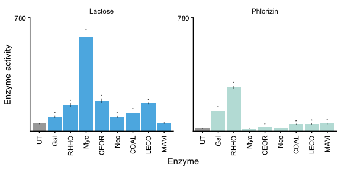
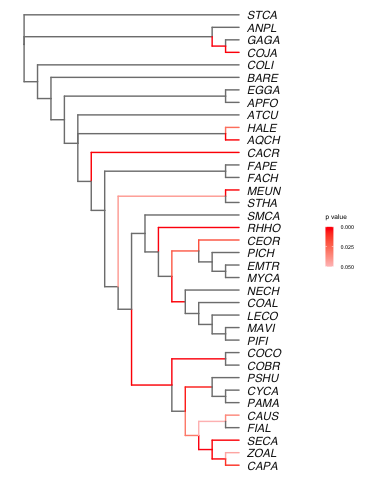
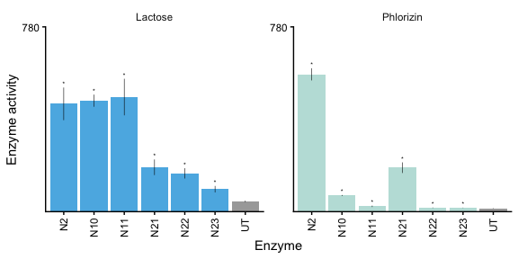
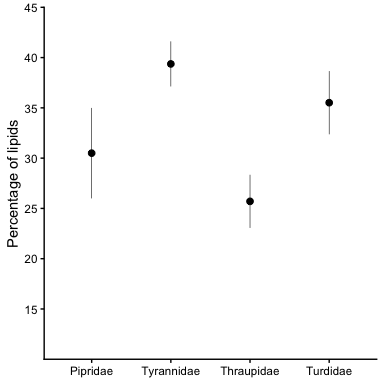
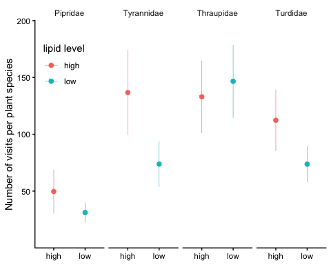
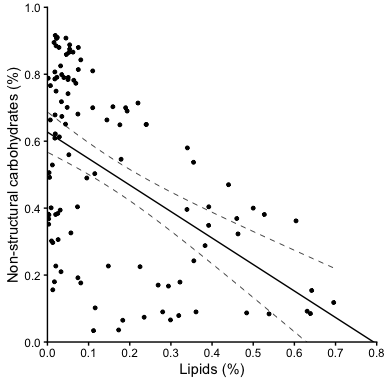
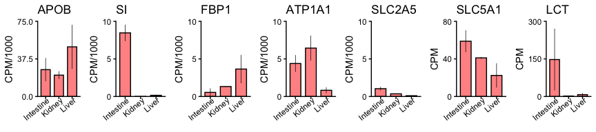
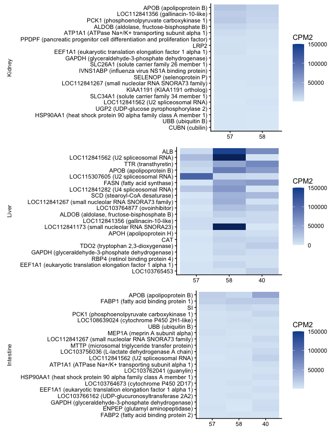

Manakin figure 4 related
================
Maggie
2026-02-28

- [Load file for 4A](#load-file-for-4a)
  - [Fig.4A](#fig4a)
- [Fig.4B aBSREL](#fig4b-absrel)
- [Load file for 4B](#load-file-for-4b)
  - [Fig.4B](#fig4b)
- [Load file for S4A-C](#load-file-for-s4a-c)
  - [Fig.S4A](#figs4a)
  - [Fig.S4B](#figs4b)
  - [Fig.S4C](#figs4c)
- [Load file for S4D-E](#load-file-for-s4d-e)
  - [Fig.S4D](#figs4d)
  - [Fig.S4E](#figs4e)

This [R Markdown](http://rmarkdown.rstudio.com) Notebook contains codes
for reproducing Fig.4A, 4B and Fig.S4A-E of Balakrishnan et al. ‘Genomic
and physiological changes in a sexually selected and frugivorous bird
radiation’.

## Load file for 4A

``` r
path = "data/Fig4A.csv"
stats = read_csv(path)

input = c("UT", "Gal", "RHHO", "Myo", "CEOR", "Neo", "COAL", "LECO", "MAVI")

# reconstruct plotting df: mean_1/sem_1 = UT reference, mean_2/sem_2 = each enzyme; AUC/1000
df_ut    = stats %>% dplyr::select(Ligand, mean = mean_1, sem = sem_1) %>%
             mutate(Enzyme = "UT", mean = mean / 1000, sem = sem / 1000) %>% distinct()
df_other = stats %>% dplyr::select(Enzyme, Ligand, mean = mean_2, sem = sem_2) %>%
             mutate(mean = mean / 1000, sem = sem / 1000)
df = bind_rows(df_ut, df_other)
```

### Fig.4A

``` r
ligands_reorder = c("Lactose", "Phlorizin")

df$Ligand = factor(df$Ligand, levels = ligands_reorder)
df$Enzyme = factor(df$Enzyme, levels = input)

df = df %>%
  mutate(Ligand2 = ifelse(Enzyme == "UT", "UT", as.character(Ligand)))
df$Ligand2 = factor(df$Ligand2, levels = c("UT", "Lactose", "Phlorizin"))

tmp_stat_df = stats %>%
  mutate(lab  = ifelse(padj_onesided_FDR < 0.05, '*', NA),
         mean = mean_2 / 1000,
         sem  = sem_2  / 1000) %>%
  dplyr::select(Enzyme, Ligand, mean, sem, lab)
tmp_stat_df$Enzyme = factor(tmp_stat_df$Enzyme, levels = input)
tmp_stat_df$Ligand = factor(tmp_stat_df$Ligand, levels = ligands_reorder)

y_limit = 780

p_lct_wt = ggplot(df, aes(x = Enzyme, y = mean)) +
  geom_col(aes(fill = Ligand2), alpha = 0.85) +
  geom_errorbar(aes(ymin = mean - sem, ymax = mean + sem), width = 0, size = 0.2) +
  geom_text(data = tmp_stat_df, aes(y = (mean + sem) + 15, label = lab), size = FontSize * 0.75) +
  scale_y_continuous(name = 'Enzyme activity',
                     limits = c(NA, y_limit), breaks = y_limit,
                     expand = c(0, 0)) +
  scale_fill_manual(values = c("#989898ff", "#35a8e0ff", "#b2dbd5ff")) +
  facet_wrap(. ~ Ligand, scales = 'free') +
  theme_classic() +
  theme(axis.text.x = element_text(angle = 90, hjust = 1, vjust = 0.5),
        strip.background = element_blank(),
        legend.position = "none"); p_lct_wt
```

    ## Warning: Using `size` aesthetic for lines was deprecated in ggplot2 3.4.0.
    ## ℹ Please use `linewidth` instead.
    ## This warning is displayed once per session.
    ## Call `lifecycle::last_lifecycle_warnings()` to see where this warning was
    ## generated.

    ## Warning: Removed 3 rows containing missing values or values outside the scale range
    ## (`geom_text()`).

<!-- -->

## Fig.4B aBSREL

``` r
path = "data/Fig4B_LPH_trimmed_absrel.json"
tmp  = fromJSON(txt = path)

# extract tree
tree = read.tree(text = paste0(tmp$input$trees$`0`, ";"))

# extract branch attributes
tmp_b = tmp$`branch attributes`$`0`

df = lapply(1:length(tmp_b), function(i){
  tmp_b[[i]] %>%
    map_if(is.matrix, function(s){ data.frame(matrix(s, nrow = 1)) }) %>%
    map_if(is.data.frame, list) %>%
    as_tibble() %>% unnest(cols = c(`Rate Distributions`))
}) %>% bind_rows() %>% add_column("Name" = names(tmp_b)) %>%
  select(-`original name`)

# parse omega classes
ind = grep("X\\d+", names(df))
trouble = df[, ind] %>% as.matrix()
trouble_sorted = lapply(1:nrow(trouble), function(row_i){
  x     = trouble[row_i, ]
  step1 = na.omit(x)
  n     = length(step1); half = n / 2
  tmp_omega      = matrix(step1[1:half], nrow = 1) %>% as_tibble()
  names(tmp_omega) = paste0("Omega", 1:half)
  tmp_proportion = matrix(step1[(half+1):n], nrow = 1) %>% as_tibble()
  names(tmp_proportion) = paste0("Proportion", 1:half)
  cbind("Name" = df$Name[row_i], tmp_omega, tmp_proportion,
        "HighestOmega" = step1[half], "HigheshProportion" = step1[n]) %>% as_tibble()
}) %>% bind_rows()

df_3 = df %>% select(-all_of(ind)) %>% left_join(trouble_sorted) %>%
  mutate(`Uncorrected_P.value<0.05` = ifelse(`Uncorrected P-value` < 0.05,
                                             `Uncorrected P-value`, NA))

# attach data to tree
tree_phy = tree %>% as_tibble() %>%
  left_join(df_3, by = c("label" = "Name")) %>%
  as.treedata()

# plot
linewidth  = 0.5
x_limit    = 25
rootedge   = 2
offset_tip = x_limit / 50

tree_p = ggtree(tree_phy, size = linewidth, aes(col = `Uncorrected_P.value<0.05`)) +
  geom_tiplab(offset = offset_tip, size = 3, color = "grey10", fontface = 3) +
  xlim_tree(x_limit) +
  scale_color_continuous(low = 'red', high = 'rosybrown1', na.value = "grey50",
                         n.breaks = 3, limits = c(0, 0.05)) +
  guides(color = guide_colorbar(title = "p value", reverse = TRUE)) +
  theme_tree() +
  theme(legend.position  = c(0.9, 0.5),
        legend.title     = element_text(size = AxisTxFontSizeSize),
        legend.text      = element_text(size = AxisTxFontSizeSize_s),
        legend.key.size  = unit(6, 'pt'))

tree_p = tree_p %>% rotate(38)
tree_p = tree_p %>% rotate(46)
tree_p = tree_p %>% rotate(47)
tree_p = tree_p %>% rotate(56)

if (is.rooted(tree_phy)) {
  tree_p = tree_p + geom_rootedge(rootedge = rootedge, color = "grey50", size = linewidth)
}

tree_p
```

<!-- -->

## Load file for 4B

``` r
path = "data/Fig4B.csv"
stats = read_csv(path)

input = c("N2", "N10", "N11", "N21", "N22", "N23", "UT")

# reconstruct plotting df: mean_1/sem_1 = UT reference, mean_2/sem_2 = each enzyme; AUC/1000
df_ut    = stats %>% dplyr::select(Ligand, mean = mean_1, sem = sem_1) %>%
             mutate(Enzyme = "UT", mean = mean / 1000, sem = sem / 1000) %>% distinct()
df_other = stats %>% dplyr::select(Enzyme, Ligand, mean = mean_2, sem = sem_2) %>%
             mutate(mean = mean / 1000, sem = sem / 1000)
df = bind_rows(df_ut, df_other)
```

### Fig.4B

<!-- -->

## Load file for S4A-C

``` r
path = "data/FigS4A-C_dados_spp_level_with bird families.xlsx"
lipid_data0 = read_excel(path)

family_order = c("Pipridae", "Tyrannidae", "Thraupidae", "Turdidae")
lipid_data0 = lipid_data0 %>%
  filter(bird_family %in% family_order) %>%
  mutate(lipids  = lipid * 100,
         `lipid-level`       = ifelse(lipids > 10, 'high', 'low'),
         bird_family_updated = ifelse(is.na(bird_family_updated), bird_family, bird_family_updated),
         Bird_species        = gsub("_", " ", phylo),
         Plant_species       = gsub("_", " ", Phylo_name))
```

### Fig.S4A

``` r
lipid_data1 = lipid_data0 %>%
  mutate(lipid_consumption = lipids * visits)

lipid_data2 = lipid_data1 %>%
  group_by(bird_family) %>%
  summarise(weighted_mean = sum(lipid_consumption, na.rm = TRUE) / sum(visits, na.rm = TRUE),
            w4 = diagis::weighted_se(x = lipids, w = visits)) %>%
  mutate(bird_family = fct_relevel(bird_family, family_order))

p_a = ggplot(lipid_data2, aes(x = bird_family, y = weighted_mean)) +
  geom_point(size = 2) +
  geom_errorbar(aes(ymin = weighted_mean - w4, ymax = weighted_mean + w4),
                width = 0, linewidth = 0.2) +
  scale_y_continuous(name = 'Percentage of lipids',
                     limits = c(10, 45), breaks = seq(15, 45, by = 5),
                     expand = c(0, 0)) +
  theme_classic() +
  theme(axis.title.x = element_blank(),
        legend.position = "none"); p_a
```

<!-- -->

### Fig.S4B

``` r
lipid_lv_order = c("high", "low")

lipid_data = lipid_data0 %>%
  dplyr::rename(`lipid level` = `lipid-level`) %>%
  group_by(bird_family, `lipid level`, Plant_species) %>%
  summarise(sum_plant = sum(visits, na.rm = TRUE)) %>%
  group_by(bird_family, `lipid level`) %>%
  summarise(mean = mean(sum_plant, na.rm = TRUE),
            n    = n(),
            sd   = sd(sum_plant,   na.rm = TRUE)) %>%
  mutate(sem = sd / sqrt(n))

lipid_data$bird_family   = factor(lipid_data$bird_family,   family_order)
lipid_data$`lipid level` = factor(lipid_data$`lipid level`, lipid_lv_order)

w = 0.5
p_b = ggplot(lipid_data, aes(x = `lipid level`, y = mean, color = `lipid level`)) +
  geom_point(position = position_dodge(width = w), size = 2) +
  geom_errorbar(aes(ymin = mean - sem, ymax = mean + sem),
                width = 0, linewidth = 0.2,
                position = position_dodge(width = w)) +
  facet_grid(. ~ bird_family) +
  scale_y_continuous(name = 'Number of visits per plant species',
                     limits = c(0, 200), breaks = seq(50, 200, 50),
                     expand = c(0, 0)) +
  theme_classic() +
  theme(strip.background = element_blank(),
        axis.title.x     = element_blank(),
        legend.position  = c(0.1, 0.8)); p_b
```

<!-- -->

### Fig.S4C

``` r
path = "data/FigS4A-C_Pizo_data.xlsx"
lipid_data0_cor = read_excel(path, sheet = 2)

# extract full-range CI bounds from lm smooth
p_tmp = ggplot(lipid_data0_cor, aes(x = LIP, y = NSC)) +
  geom_smooth(method = 'lm', fullrange = TRUE)
gg2 = ggplot_build(p_tmp)$data[[1]]

p_c = ggplot(lipid_data0_cor, aes(x = LIP, y = NSC)) +
  geom_point(size = 1) +
  geom_smooth(method = 'lm', fullrange = TRUE, se = FALSE,
              linewidth = 0.5, color = 'black') +
  geom_line(data = gg2, aes(x = x, y = ymin), linetype = 2, linewidth = 0.25) +
  geom_line(data = gg2, aes(x = x, y = ymax), linetype = 2, linewidth = 0.25) +
  scale_x_continuous(name = 'Lipids (%)',
                     expand = c(0, 0),
                     limits = c(0, 0.8), breaks = seq(0, 0.8, .1)) +
  scale_y_continuous(name = 'Non-structural carbohydrates (%)',
                     limits = c(-2, 1), breaks = seq(0, 1, .2),
                     expand = c(0, 0)) +
  coord_cartesian(xlim = c(0, 0.8), ylim = c(0, 1)) +
  theme_classic() +
  theme(strip.background = element_blank(),
        legend.position  = "none"); p_c
```

<!-- -->

## Load file for S4D-E

``` r
sample_info = read_csv("data/rnaseq/sample_info.csv", show_col_types = FALSE)

star_files  = list.files("data/rnaseq/star", pattern = "\\.tab$", full.names = TRUE)
counts_wide = lapply(star_files, function(f){
  nm = gsub("_ReadsPerGene.out.tab", "", basename(f))
  read_tsv(f, skip = 4, col_names = c("gene", "unstranded", "fwd", "rev"),
           show_col_types = FALSE) %>%
    dplyr::select(gene, !!nm := unstranded)
}) %>% purrr::reduce(full_join, by = "gene") %>%
  column_to_rownames("gene")

dge    = DGEList(counts = as.matrix(counts_wide))
dge    = calcNormFactors(dge)
nc_gap = cpm(dge) %>% as_tibble(rownames = "gene") %>%
  pivot_longer(-gene, names_to = "Sample", values_to = "CPM") %>%
  left_join(sample_info, by = "Sample")
```

### Fig.S4D

``` r
gene_map = tribble(
  ~gene_id,        ~label,
  "APOB",          "APOB",
  "SI",            "SI",
  "LOC103756962",  "FBP1",
  "ATP1A1",        "ATP1A1",
  "LOC103762172",  "SLC2A5",
  "SLC5A1",        "SLC5A1",
  "LCT",           "LCT"
)
label_order = gene_map$label

y_lim_df = tibble(
  label = label_order,
  y     = c(75, 10, 10, 10, 10, 80, 300)
)

nc_sub = nc_gap %>%
  inner_join(gene_map, by = c("gene" = "gene_id")) %>%
  group_by(label, Tissue) %>%
  summarise(mean = mean(CPM, na.rm = TRUE),
            sd   = sd(CPM,   na.rm = TRUE),
            n    = n(),
            sem  = sd / sqrt(n),
            .groups = "drop") %>%
  left_join(y_lim_df, by = "label") %>%
  mutate(label = factor(label, levels = label_order))

make_gene_plot = function(g){
  d            = nc_sub %>% filter(label == g)
  y_limit      = unique(d$y)
  y_limit_data = max(d$mean + d$sd, na.rm = TRUE) * 1.01
  breaks_tmp   = round(seq(0, y_limit, length.out = 3), 1)
  if (y_limit_data >= 1000) {
    ggplot(d, aes(x = Tissue, y = mean / 1000)) +
      geom_col(alpha = 0.5, fill = "#ff0000ff", color = "black", width = 0.7, size = 0.25) +
      geom_errorbar(aes(ymin = (mean - sem) / 1000, ymax = (mean + sem) / 1000),
                    width = 0, size = 0.25) +
      scale_y_continuous(name = "CPM/1000", limits = c(NA, y_limit),
                         breaks = breaks_tmp, expand = c(0, 0)) +
      ggtitle(g) +
      theme_classic() +
      theme(axis.title.x   = element_blank(),
            axis.text.x    = element_text(angle = 40, vjust = 1.2, hjust = 1),
            legend.position = "none")
  } else {
    ggplot(d, aes(x = Tissue, y = mean)) +
      geom_col(alpha = 0.5, fill = "#ff0000ff", color = "black", width = 0.7, size = 0.25) +
      geom_errorbar(aes(ymin = mean - sem, ymax = mean + sem),
                    width = 0, size = 0.25) +
      scale_y_continuous(name = "CPM", limits = c(NA, y_limit),
                         breaks = breaks_tmp, expand = c(0, 0)) +
      ggtitle(g) +
      theme_classic() +
      theme(axis.title.x   = element_blank(),
            axis.text.x    = element_text(angle = 40, vjust = 1.2, hjust = 1),
            legend.position = "none")
  }
}

pp = lapply(label_order, make_gene_plot)
plot_grid(plotlist = pp, nrow = 1)
```

<!-- -->

### Fig.S4E

``` r
N = 20
tissues_order = c("Kidney", "Liver", "Intestine")

TopN = nc_gap %>%
  group_by(Tissue, gene) %>%
  summarise(gm  = exp(mean(log(CPM[CPM > 0]))),
            ave = mean(CPM, na.rm = TRUE),
            .groups = "drop") %>%
  group_by(Tissue) %>%
  slice_max(order_by = gm, n = N, with_ties = TRUE)

# parse gene names (Manacus entries only)
gotLOC = read_tsv("data/rnaseq/gotGeneName_withquail.txt",
                  col_names = "X1", show_col_types = FALSE) %>%
  filter(!grepl("^current:", X1), grepl("Manacus", X1)) %>%
  mutate(gene = gsub("(\\w+)\\s.*",           "\\1", X1),
         name = gsub("\\w+\\s(.*)\\[.*\\]", "\\1", X1)) %>%
  dplyr::select(gene, name)

TopN2 = TopN %>%
  left_join(gotLOC, by = "gene") %>%
  mutate(lab = ifelse(!is.na(name), paste0(gene, " (", name, ")"), gene),
         lab = gsub("^ALB .*", "ALB (albumin)", lab))

nc_long = lapply(tissues_order, function(s){
  sel = TopN %>% filter(Tissue == s)
  nc_gap %>% filter(Tissue == s, gene %in% sel$gene)
}) %>% bind_rows()

nc_long2 = nc_long %>%
  left_join(gotLOC, by = "gene") %>%
  mutate(lab  = ifelse(!is.na(name), paste0(gene, " (", name, ")"), gene),
         lab  = gsub("^ALB .*", "ALB (albumin)", lab),
         bird = gsub("MV-(\\d+)-.*", "\\1", Sample),
         CPM2 = ifelse(CPM > 200000, NA, CPM)) %>%
  left_join(TopN2 %>% dplyr::select(Tissue, gene, gm), by = c("Tissue", "gene"))

nc_long2$Tissue = factor(nc_long2$Tissue, levels = tissues_order)
nc_long2$bird   = factor(nc_long2$bird,   levels = c("57", "58", "40"))

pal = brewer.pal(9, "Blues")[c(2, 8, 9)]

pl = lapply(tissues_order, function(s){
  tmp = nc_long2 %>% filter(Tissue == s) %>%
    mutate(lab = fct_reorder(lab, gm, .desc = TRUE))
  ggplot(tmp, aes(x = bird, y = lab, fill = CPM2)) +
    geom_tile() +
    scale_fill_gradient(low = pal[1], high = pal[2], na.value = pal[3],
                        limits = c(NA, 150000)) +
    scale_y_discrete(limits = rev) +
    facet_grid(Tissue ~ ., scales = "free", space = "free", switch = "y") +
    theme_classic() +
    theme(strip.background = element_blank(),
          strip.placement  = "outside",
          axis.title.y     = element_blank(),
          axis.title.x     = element_blank(),
          legend.position  = "right")
})

plot_grid(plotlist = pl, ncol = 1)
```

<!-- -->
