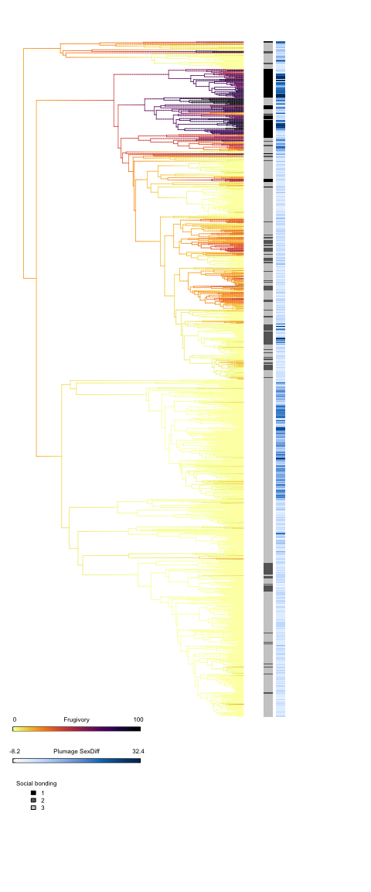
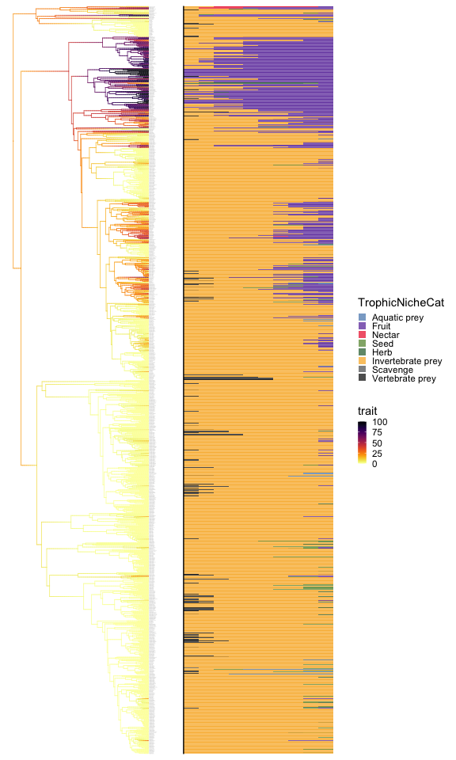
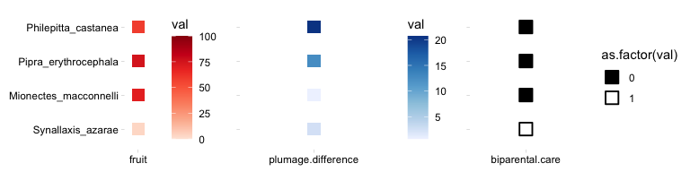
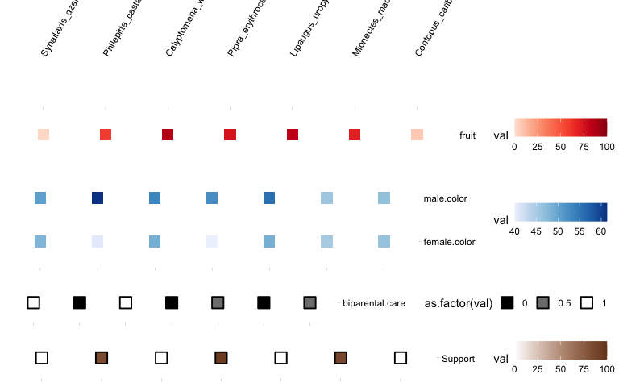

Manakin figure 5 related
================
Maggie
2026-05-11

- [Load files](#load-files)
- [Fig5A - Frugivory + SexDiff + social bonding
  (ape)](#fig5a---frugivory--sexdiff--social-bonding-ape)
- [FigS5A - Frugivory ancestral state reconstruction + diet breakdown
  (ggtree)](#figs5a---frugivory-ancestral-state-reconstruction--diet-breakdown-ggtree)
- [Fig5B - Plumage, fruit, and support dot
  plots](#fig5b---plumage-fruit-and-support-dot-plots)
- [FigS5D - Plumage, fruit, and support dot
  plots](#figs5d---plumage-fruit-and-support-dot-plots)

This [R Markdown](http://rmarkdown.rstudio.com) Notebook contains codes
for reproducing Fig.5A, 5B and Fig.S5A of Balakrishnan et al. ‘Genomic
and physiological changes in a sexually selected and frugivorous bird
radiation’.

## Load files

``` r
# tree
path = "data/Fig5A_pruned12Jan2021.tre"
bigtree = read.tree(file = path) # 1178

# plumage scores
path = "data/Fig5A_plumage_scores.csv"
sexdim = read_csv(file = path)

# name exchange table (DALE names -> tree tip labels)
path = "data/Fig5A_ManakinNamePlotDale_m.csv"
name_exchange = read_csv(path)

# build sexdim2: adds TipLabel_mod and SexDiff columns
sexdim2 = sexdim %>%
  left_join(name_exchange, by = c("Scientific_name" = "DALE")) %>%
  mutate(tree75sp_mod = ifelse(is.na(tree75sp), Scientific_name, tree75sp),
         TipLabel_mod = gsub(" ", "_", tree75sp_mod),
         SexDiff      = Male_plumage_score - Female_plumage_score)

# combined traits table (diet + morphology)
path = "data/Fig5A_Traits_combined_2020-10-24.csv"
merged4 = read_csv(path)

# join: attach Scientific_name, SexDiff to trait data
diet_sexdim = merged4 %>%
  right_join(sexdim2, by = c("Tip_Label" = "TipLabel"))

# social bonding data
path = "data/Fig5A_preppedSocialBonds.csv"
social = read_csv(path)

diet_sexdim = diet_sexdim %>%
  left_join(social, by = c("Tip_Label" = "species"))

# color scheme (for FigS5A)
path = "data/Fig5A_Diet_ColorSchemes.csv"
colorscheme = read_csv(path)
colorscheme$color_5_202201_alpha = scales::alpha(colorscheme$color_5_202201, 0.7)
```

## Fig5A - Frugivory + SexDiff + social bonding (ape)

<!-- -->

## FigS5A - Frugivory ancestral state reconstruction + diet breakdown (ggtree)

``` r
# convert tip labels from Genus_species to "Genus species"
final_m0 = bigtree
final_m0$tip.label = sapply(final_m0$tip.label, function(s) {
  if (!is.na(s)) paste(unlist(strsplit(s, "_"))[1:2], collapse = " ") else s
})

# attach frugivory scores to tree tips; drop species without data
trait_data = final_m0 %>%
  as_tibble() %>%
  left_join(diet_sexdim, by = c("label" = "Scientific_name")) %>%
  mutate(TrophicNiche = gsub("Herbivore terrestrial", "Herbivore", TrophicNiche),
         Group = ifelse(grepl("Frugivore", TrophicNiche), "Frugivore", "Non-frugivore")) %>%
  filter(!is.na(Fr))

toremove  = setdiff(final_m0$tip.label, trait_data$label)
tree_trim = final_m0 %>% drop.tip(toremove)

# match trait values to tree tip order
ind   = sapply(tree_trim$tip.label, function(s) grep(s, trait_data$label))
trait = trait_data$Fr[ind]
names(trait) = trait_data$label[ind]

# ancestral state reconstruction
fit = phytools::fastAnc(tree_trim, trait, vars = TRUE, CI = TRUE)

td = data.frame(node = nodeid(tree_trim, names(trait)), trait = trait)
nd = data.frame(node = names(fit$ace),                  trait = fit$ace)
d  = rbind(td, nd)
d$node = as.numeric(d$node)
tree_trim_m = full_join(tree_trim, d, by = "node")

# color palette
pal = viridis_pal(option = "inferno", direction = -1)(50)

x_limit = max(tree_trim_m@phylo$edge) * 0.021

# tree panel: branches colored by frugivory score
tree_p = ggtree(tree_trim_m, size = 0.25, aes(color = trait),
                continuous = "colour") +
  geom_tiplab(offset = 0.001, size = 0.18, color = "grey50") +
  scale_color_gradientn(colours = pal) +
  xlim_tree(x_limit) +
  theme_tree() +
  theme(legend.position = "bottom")

root_node = ape::Ntip(tree_trim) + 1
tree_p = tree_p %>% ggtree::rotate(root_node)

# diet bar panel: proportions of each dietary category per species
merged5 = merged4 %>%
  mutate(newname = gsub("_", " ", Tip_Label))

target_species = merged5 %>%
  filter(newname %in% tree_trim_m@phylo$tip.label)

traits_m4_long = target_species %>%
  pivot_longer(cols = c(In:Herb),
               names_to  = "TrophicNicheCat",
               values_to = "value2") %>%
  mutate(TrophicNicheCat = gsub("In",   "Invertebrate prey", TrophicNicheCat),
         TrophicNicheCat = gsub("Aq",   "Aquatic prey",      TrophicNicheCat),
         TrophicNicheCat = gsub("Vt",   "Vertebrate prey",   TrophicNicheCat),
         TrophicNicheCat = gsub("Ca",   "Scavenge",          TrophicNicheCat),
         TrophicNicheCat = gsub("Ne",   "Nectar",            TrophicNicheCat),
         TrophicNicheCat = gsub("Fr",   "Fruit",             TrophicNicheCat),
         TrophicNicheCat = gsub("SETe", "Seed",              TrophicNicheCat),
         TrophicNicheCat = gsub("Herb", "Herb",              TrophicNicheCat)) %>%
  select(newname, TrophicNicheCat, value2)

lv_tmp = c("Aquatic prey", "Fruit", "Nectar", "Seed", "Herb",
           "Invertebrate prey", "Scavenge", "Vertebrate prey")
traits_m4_long$TrophicNicheCat = factor(traits_m4_long$TrophicNicheCat, levels = lv_tmp)

col_pal_sm = colorscheme$color_5_202201_alpha[-c(9, 10)]

theme_tmp = theme_m + theme(
  strip.text        = element_blank(),
  axis.line         = element_blank(),
  axis.ticks        = element_blank(),
  axis.text.x       = element_blank(),
  axis.text.y       = element_blank(),
  axis.title.x      = element_blank(),
  axis.title.y      = element_blank(),
  legend.key.size   = unit(8, "points"),
  legend.position   = "right")

tree_p2 = tree_p +
  geom_facet(panel = "Diet class break down", data = traits_m4_long, geom = geom_col,
             aes(x = value2, group = TrophicNicheCat, fill = TrophicNicheCat),
             color = "transparent", size = 0.001,
             orientation = "y", width = 1) +
  geom_facet(panel = "Diet class break down", data = traits_m4_long, geom = geom_vline,
             aes(xintercept = 0)) +
  scale_fill_manual(values = col_pal_sm) +
  guides(fill = guide_legend(ncol = 1, byrow = TRUE, reverse = FALSE)) +
  theme_tmp

tree_p2
```

<!-- -->

## Fig5B - Plumage, fruit, and support dot plots

``` r
path  = "data/Fig5B_S5D_optima25Feb2022_3_m.csv"
trait = read_csv(path)

trait_sub = trait %>%
  filter(species %in% c("Synallaxis_azarae", "Mionectes_macconnelli",
                        "Pipra_erythrocephala", "Philepitta_castanea"))

trait_sub_l = trait_sub %>%
  pivot_longer(cols = c(plumage.difference,fruit,biparental.care), names_to = "col", values_to = "val")

trait_sub_l$species = factor(trait_sub_l$species, 
                             levels = c("Synallaxis_azarae", "Mionectes_macconnelli",
                                        "Pipra_erythrocephala", "Philepitta_castanea"))
```

<!-- -->

## FigS5D - Plumage, fruit, and support dot plots

``` r
trait_sub = trait %>%
  filter(species %in% c("Synallaxis_azarae", "Philepitta_castanea", "Calyptomena_whiteheadi",
                        "Pipra_erythrocephala", "Lipaugus_uropygialis",
                        "Mionectes_macconnelli", "Contopus_caribaeus"))

trait_sub_l = trait_sub %>%
  pivot_longer(cols = male.color:Support, names_to = "col", values_to = "val")

trait_sub_l$col = factor(trait_sub_l$col,
                         levels = c("fruit", "female.color", "male.color", "biparental.care", "Support"))
trait_sub_l$species = factor(trait_sub_l$species, 
                             levels = c("Synallaxis_azarae", "Philepitta_castanea", "Calyptomena_whiteheadi",
                        "Pipra_erythrocephala", "Lipaugus_uropygialis",
                        "Mionectes_macconnelli", "Contopus_caribaeus"))
```

<!-- -->
